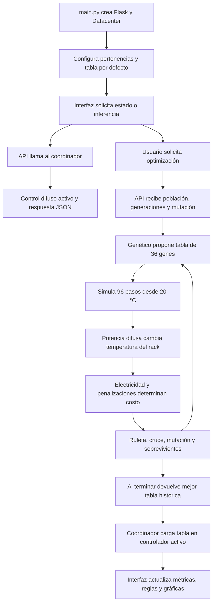

# Flujo del código y guía para mostrarlo en la defensa

Código revisado: `16c5f20984bd9c2e2a9a03c55e3c227b387bb0ab`, rama `feature-sin-apriori`. Fecha: 30 de septiembre de 2026. Esta guía explica el código actual; no añade experimentos ni cambia su funcionamiento. Los resultados experimentales anteriores están en README.md y conservan su propio commit de referencia.

**Cómo estudiar esta guía:** abre el archivo enlazado, localiza la función indicada y explica qué recibe, qué transforma y qué devuelve. El enlace abre la primera línea del intervalo. Los nombres exactos permiten buscar el bloque si cambian las líneas.

**[ENSEÑADO EN CLASE]** Integrar genético y difuso; Mamdani con fusificación, inferencia, agregación y centroide; población, evaluación, ruleta, cruce en un punto, mutación de un individuo/un gen con probabilidad fija y sobrevivientes al azar. **[PROPUESTA DEL EQUIPO]** El problema de climatización, la representación de 36 genes, el modelo, sus parámetros, la inicialización guiada, los límites críticos y la aplicación web. Los números físicos requieren las fuentes y calibración pendientes del README.

## 1. Idea central y mapa de archivos

El difuso decide **cuánta potencia de refrigeración aplicar ahora**. El genético busca **qué consecuente asignar a cada una de las 36 reglas**. Para valorar una tabla, se simula un día completo y se calcula su costo. El genético no modifica las funciones de pertenencia ni descubre los antecedentes.

| Archivo | Responsabilidad | Dónde abrir |
| --- | --- | --- |
| `main.py` | Crea Flask, el datacenter y las rutas web. | [main.py:18–34](/home/saimoljimenez/Univercidad/IA/ProyectoCLimatico/app_climatizacion/main.py:18) |
| `backend/controladores/controlador_api.py` | Recibe peticiones y convierte resultados a JSON. | [controlador_api.py:6–112](/home/saimoljimenez/Univercidad/IA/ProyectoCLimatico/app_climatizacion/backend/controladores/controlador_api.py:6) |
| `backend/negocio/climatizacion_datacenter.py` | Coordina el controlador activo y la optimización. | [climatizacion_datacenter.py:35–70](/home/saimoljimenez/Univercidad/IA/ProyectoCLimatico/app_climatizacion/backend/negocio/climatizacion_datacenter.py:35) |
| `backend/negocio/climatizacion_difusa.py` | Define variables y convierte genes en reglas. | [climatizacion_difusa.py:18–144](/home/saimoljimenez/Univercidad/IA/ProyectoCLimatico/app_climatizacion/backend/negocio/climatizacion_difusa.py:18) |
| `backend/modelos/control_difuso.py` | Encapsula los objetos y la inferencia de skfuzzy. | [control_difuso.py:20–167](/home/saimoljimenez/Univercidad/IA/ProyectoCLimatico/app_climatizacion/backend/modelos/control_difuso.py:20) |
| `backend/negocio/optimizacion_energetica.py` | Simula el día y calcula costos. | [optimizacion_energetica.py:139–245](/home/saimoljimenez/Univercidad/IA/ProyectoCLimatico/app_climatizacion/backend/negocio/optimizacion_energetica.py:139) |
| `backend/modelos/algoritmo_genetico.py` | Genera y evoluciona tablas de reglas. | [algoritmo_genetico.py:107–297](/home/saimoljimenez/Univercidad/IA/ProyectoCLimatico/app_climatizacion/backend/modelos/algoritmo_genetico.py:107) |
| `backend/fuentes_datos/sensores_servidores.py` | Genera el CSV sintético. | [sensores_servidores.py:19–117](/home/saimoljimenez/Univercidad/IA/ProyectoCLimatico/app_climatizacion/backend/fuentes_datos/sensores_servidores.py:19) |
| `frontend/js/app.js` | Envía peticiones y actualiza la interfaz. | [app.js:807–857](/home/saimoljimenez/Univercidad/IA/ProyectoCLimatico/app_climatizacion/frontend/js/app.js:807) |

## 2. Flujo completo



### Recorrido A: arranque

1. [main.py:18–25](/home/saimoljimenez/Univercidad/IA/ProyectoCLimatico/app_climatizacion/main.py:18) crea `aplicacion_flask`, construye `ClimatizacionDatacenter` y registra el controlador API. No inicia una evolución al importar la aplicación.
2. [climatizacion_datacenter.py:35–54](/home/saimoljimenez/Univercidad/IA/ProyectoCLimatico/app_climatizacion/backend/negocio/climatizacion_datacenter.py:35) prepara el generador, crea el difuso y el optimizador y carga `TABLA_REGLAS_POR_DEFECTO`. Si el CSV no existe, lo genera y escribe.
3. [climatizacion_difusa.py:18–89](/home/saimoljimenez/Univercidad/IA/ProyectoCLimatico/app_climatizacion/backend/negocio/climatizacion_difusa.py:18) configura las tres entradas y la salida. [climatizacion_datacenter.py:60–70](/home/saimoljimenez/Univercidad/IA/ProyectoCLimatico/app_climatizacion/backend/negocio/climatizacion_datacenter.py:60) guarda la tabla activa y pide convertirla en reglas.
4. [climatizacion_difusa.py:92–144](/home/saimoljimenez/Univercidad/IA/ProyectoCLimatico/app_climatizacion/backend/negocio/climatizacion_difusa.py:92) crea las reglas; [control_difuso.py:139–143](/home/saimoljimenez/Univercidad/IA/ProyectoCLimatico/app_climatizacion/backend/modelos/control_difuso.py:139) construye `ControlSystem` y `ControlSystemSimulation`.
5. [main.py:28–34](/home/saimoljimenez/Univercidad/IA/ProyectoCLimatico/app_climatizacion/main.py:28) entrega HTML y recursos. [app.js:136–148](/home/saimoljimenez/Univercidad/IA/ProyectoCLimatico/app_climatizacion/frontend/js/app.js:136) consulta `/api/estado`; [controlador_api.py:10–26](/home/saimoljimenez/Univercidad/IA/ProyectoCLimatico/app_climatizacion/backend/controladores/controlador_api.py:10) pide la simulación actual. Esta consulta sí simula, pero no evoluciona.

### Recorrido B: inferencia de un punto

La interfaz envía rack, CPU y exterior a `/api/inferencia`: [app.js:763–770](/home/saimoljimenez/Univercidad/IA/ProyectoCLimatico/app_climatizacion/frontend/js/app.js:763). La API lee los tres números y llama al coordinador: [controlador_api.py:63–75](/home/saimoljimenez/Univercidad/IA/ProyectoCLimatico/app_climatizacion/backend/controladores/controlador_api.py:63). Este delega en `ClimatizacionDifusa`: [climatizacion_datacenter.py:111–117](/home/saimoljimenez/Univercidad/IA/ProyectoCLimatico/app_climatizacion/backend/negocio/climatizacion_datacenter.py:111).

En [climatizacion_difusa.py:194–212](/home/saimoljimenez/Univercidad/IA/ProyectoCLimatico/app_climatizacion/backend/negocio/climatizacion_difusa.py:194), `evaluar_punto_operacion` arma el diccionario de entradas, obtiene la potencia y recupera la curva agregada. En [control_difuso.py:145–167](/home/saimoljimenez/Univercidad/IA/ProyectoCLimatico/app_climatizacion/backend/modelos/control_difuso.py:145), `evaluar` introduce los valores en el simulador, llama a `compute()` y devuelve el porcentaje redondeado. **Esta petición no ejecuta el balance térmico de un día**: responde a un punto de operación.

### Recorrido C: optimización

1. [app.js:807–830](/home/saimoljimenez/Univercidad/IA/ProyectoCLimatico/app_climatizacion/frontend/js/app.js:807) lee N, G y mutación; convierte el porcentaje a probabilidad mediante `/100.0` y envía POST.
2. [controlador_api.py:86–101](/home/saimoljimenez/Univercidad/IA/ProyectoCLimatico/app_climatizacion/backend/controladores/controlador_api.py:86) lee parámetros; [climatizacion_datacenter.py:128–139](/home/saimoljimenez/Univercidad/IA/ProyectoCLimatico/app_climatizacion/backend/negocio/climatizacion_datacenter.py:128) delega en el optimizador.
3. [optimizacion_energetica.py:330–342](/home/saimoljimenez/Univercidad/IA/ProyectoCLimatico/app_climatizacion/backend/negocio/optimizacion_energetica.py:330) actualiza parámetros y define `funcion_fitness(individuo)`, que llama a `simular_dia(individuo)`. Esta función conecta los dos algoritmos.
4. [algoritmo_genetico.py:240–297](/home/saimoljimenez/Univercidad/IA/ProyectoCLimatico/app_climatizacion/backend/modelos/algoritmo_genetico.py:240) ejecuta la búsqueda y retorna la mejor tabla histórica junto con sus detalles.
5. [optimizacion_energetica.py:345–413](/home/saimoljimenez/Univercidad/IA/ProyectoCLimatico/app_climatizacion/backend/negocio/optimizacion_energetica.py:345) compara electricidad con el termostato y construye la respuesta.
6. [climatizacion_datacenter.py:140–145](/home/saimoljimenez/Univercidad/IA/ProyectoCLimatico/app_climatizacion/backend/negocio/climatizacion_datacenter.py:140) carga la mejor tabla en el difuso activo: futuras inferencias y superficies usan esa tabla.
7. [app.js:832–857](/home/saimoljimenez/Univercidad/IA/ProyectoCLimatico/app_climatizacion/frontend/js/app.js:832) actualiza indicadores, gráficas y reglas y solicita de nuevo inferencia manual.

## 3. Explicación del difuso

**[PROPUESTA DEL EQUIPO] Entradas y salida.** Rack en °C, CPU en % y exterior en °C; salida potencia en %. Los parámetros están en [climatizacion_difusa.py:18–89](/home/saimoljimenez/Univercidad/IA/ProyectoCLimatico/app_climatizacion/backend/negocio/climatizacion_difusa.py:18). `agregar_variable_entrada` crea un `Antecedent`; `agregar_variable_salida` crea un `Consequent`: [control_difuso.py:20–28](/home/saimoljimenez/Univercidad/IA/ProyectoCLimatico/app_climatizacion/backend/modelos/control_difuso.py:20).

**[ENSEÑADO EN CLASE] Pertenencias.** El proyecto usa triángulos y trapecios. En [control_difuso.py:44–69](/home/saimoljimenez/Univercidad/IA/ProyectoCLimatico/app_climatizacion/backend/modelos/control_difuso.py:44), tres parámetros seleccionan triangular y cuatro trapezoidal; después se llama a `fuzz.trimf` o `fuzz.trapmf`. Los valores concretos son propuesta del equipo, con evidencia pendiente. Que el grado esté entre 0 y 1 no significa que la entrada física se haya normalizado.

**[PROPUESTA DEL EQUIPO] De gen a regla.** [climatizacion_difusa.py:106–119](/home/saimoljimenez/Univercidad/IA/ProyectoCLimatico/app_climatizacion/backend/negocio/climatizacion_difusa.py:106) forma 4×3×3 antecedentes. El gen solo selecciona MINIMA, MEDIA, ALTA o MAXIMA. Para índices de categorías r, c y e, el índice del gen es `9*r + 3*c + e`; exterior cambia más rápido. Por ejemplo, gen 13 corresponde a OPTIMA/MEDIO/TEMPLADO; si vale 1, su consecuente es MEDIA. La descripción para la API empieza en regla 1, aunque el cromosoma comienza en gen 0.

| Paso Mamdani [ENSEÑADO EN CLASE] | Explicación y evidencia |
| --- | --- |
| Fusificación | Asigna grados a las entradas según las curvas. Las curvas se crean en [control_difuso.py:31–91](/home/saimoljimenez/Univercidad/IA/ProyectoCLimatico/app_climatizacion/backend/modelos/control_difuso.py:31); `obtener_grado_pertenencia` permite consultarlas con interpolación en [control_difuso.py:93–99](/home/saimoljimenez/Univercidad/IA/ProyectoCLimatico/app_climatizacion/backend/modelos/control_difuso.py:93). La inferencia completa las procesa internamente al llamar a `compute()`. |
| Inferencia | La condición une tres términos mediante `&` y asigna un consecuente: [climatizacion_difusa.py:114–119](/home/saimoljimenez/Univercidad/IA/ProyectoCLimatico/app_climatizacion/backend/negocio/climatizacion_difusa.py:114). La ejecución de las reglas se delega a skfuzzy, no a un bucle manual propio de los cuatro pasos. |
| Agregación | skfuzzy acumula los aportes durante `compute()`. Para mostrar la curva resultante, [control_difuso.py:187–207](/home/saimoljimenez/Univercidad/IA/ProyectoCLimatico/app_climatizacion/backend/modelos/control_difuso.py:187) recupera cortes, recorta con `np.fmin` y une con `np.fmax.reduce`. Ese método reconstruye la curva de visualización; no es la llamada que calcula la potencia. |
| Defusificación | `centroid` se configura en [climatizacion_difusa.py:72–78](/home/saimoljimenez/Univercidad/IA/ProyectoCLimatico/app_climatizacion/backend/negocio/climatizacion_difusa.py:72). [control_difuso.py:158–161](/home/saimoljimenez/Univercidad/IA/ProyectoCLimatico/app_climatizacion/backend/modelos/control_difuso.py:158) ejecuta el simulador y lee el número final; la integral del centroide está implementada por la biblioteca. |

## 4. Explicación del genético

**[PROPUESTA DEL EQUIPO] Representación y parámetros.** Una población es una lista de individuos; cada individuo es una lista de 36 enteros. No contiene cuatro consignas horarias. Los valores predeterminados son N=20, G=20 y p=0,20: [algoritmo_genetico.py:63–65](/home/saimoljimenez/Univercidad/IA/ProyectoCLimatico/app_climatizacion/backend/modelos/algoritmo_genetico.py:63). No se fija semilla desde el botón web. Esta guía no ejecuta nuevas corridas.

| Orden real | Qué hace el código | Dónde mostrarlo |
| --- | --- | --- |
| Inicialización | Genera N tablas guiadas: secuencias no decrecientes al subir el nivel del rack. Los genes críticos quedan en {2,3}. Es propuesta del equipo sobre la población enseñada. | [algoritmo_genetico.py:107–130](/home/saimoljimenez/Univercidad/IA/ProyectoCLimatico/app_climatizacion/backend/modelos/algoritmo_genetico.py:107) |
| Evaluación | Usa tuple(individuo) como clave; simula si no existe en caché. Lee costo_total y calcula pesos relativos positivos. | [algoritmo_genetico.py:135–158](/home/saimoljimenez/Univercidad/IA/ProyectoCLimatico/app_climatizacion/backend/modelos/algoritmo_genetico.py:135) |
| Archivo inicial | Guarda copia del individuo inicial con menor costo y sus detalles. | [algoritmo_genetico.py:244–253](/home/saimoljimenez/Univercidad/IA/ProyectoCLimatico/app_climatizacion/backend/modelos/algoritmo_genetico.py:244) |
| Ruleta | Divide cada peso por la suma y sortea dos padres con random.choices. Puede salir el mismo dos veces. | [algoritmo_genetico.py:163–178](/home/saimoljimenez/Univercidad/IA/ProyectoCLimatico/app_climatizacion/backend/modelos/algoritmo_genetico.py:163) |
| Cruce | Elige un corte interior e intercambia colas. Cada generación incorpora dos hijos. | [algoritmo_genetico.py:183–192](/home/saimoljimenez/Univercidad/IA/ProyectoCLimatico/app_climatizacion/backend/modelos/algoritmo_genetico.py:183) |
| Mutación | Sortea si ocurre; después elige un individuo de la población ampliada y un solo gen. Excluye el valor actual y restringe críticos. | [algoritmo_genetico.py:197–219](/home/saimoljimenez/Univercidad/IA/ProyectoCLimatico/app_climatizacion/backend/modelos/algoritmo_genetico.py:197) |
| Nueva evaluación | Evalúa la población ampliada después de la mutación. | [algoritmo_genetico.py:264–271](/home/saimoljimenez/Univercidad/IA/ProyectoCLimatico/app_climatizacion/backend/modelos/algoritmo_genetico.py:264) |
| Mejor histórico | Si encuentra menor costo, actualiza las copias archivadas antes de la poda. | [algoritmo_genetico.py:273–279](/home/saimoljimenez/Univercidad/IA/ProyectoCLimatico/app_climatizacion/backend/modelos/algoritmo_genetico.py:273) |
| Sobrevivientes | Elimina individuos y sus pesos en índices aleatorios hasta volver a N. | [algoritmo_genetico.py:224–235](/home/saimoljimenez/Univercidad/IA/ProyectoCLimatico/app_climatizacion/backend/modelos/algoritmo_genetico.py:224) |
| Parada y respuesta | Repite range(numero_generaciones), registra historiales y devuelve el archivo histórico. | [algoritmo_genetico.py:259–297](/home/saimoljimenez/Univercidad/IA/ProyectoCLimatico/app_climatizacion/backend/modelos/algoritmo_genetico.py:259) |

**Dos aptitudes.** [optimizacion_energetica.py:225–231](/home/saimoljimenez/Univercidad/IA/ProyectoCLimatico/app_climatizacion/backend/negocio/optimizacion_energetica.py:225) devuelve `1/(1+costo_total)`. Para seleccionar padres, [algoritmo_genetico.py:145–157](/home/saimoljimenez/Univercidad/IA/ProyectoCLimatico/app_climatizacion/backend/modelos/algoritmo_genetico.py:145) ignora ese primer retorno y utiliza el costo redondeado de los detalles: `max(0.001, Cmax-Ci+0.1*(Cmax-Cmin))`. La ruleta es proporcional a esos pesos. Ambas fórmulas y el escalado son **[PROPUESTA DEL EQUIPO]**.

**Archivo no equivale a elitismo.** El mejor puede desaparecer de la población durante la poda aleatoria; su copia histórica permite devolverlo. Los pesos se calculan antes de podar y se eliminan junto con los individuos, sin volver a escalarlos después: [algoritmo_genetico.py:270–286](/home/saimoljimenez/Univercidad/IA/ProyectoCLimatico/app_climatizacion/backend/modelos/algoritmo_genetico.py:270). `historial_mejor` contiene máximos de esos pesos; `historial_convergencia` conserva el menor costo histórico. No son la misma magnitud.

## 5. Qué ocurre al evaluar una tabla

Todo este modelo es **[PROPUESTA DEL EQUIPO]**. [optimizacion_energetica.py:101–121](/home/saimoljimenez/Univercidad/IA/ProyectoCLimatico/app_climatizacion/backend/negocio/optimizacion_energetica.py:101) carga el CSV y selecciona 96 filas con índices uniformemente espaciados; no promedia intervalos. La simulación usa CPU y exterior del perfil. El rack comienza en 20 °C y evoluciona por el modelo; no toma la columna de rack del CSV. [optimizacion_energetica.py:139–178](/home/saimoljimenez/Univercidad/IA/ProyectoCLimatico/app_climatizacion/backend/negocio/optimizacion_energetica.py:139) muestra esa separación.

| Secuencia de cada paso | Explicación | Código |
| --- | --- | --- |
| Leer entorno | Lee CPU y limita exterior al universo. | [optimizacion_energetica.py:154–160](/home/saimoljimenez/Univercidad/IA/ProyectoCLimatico/app_climatizacion/backend/negocio/optimizacion_energetica.py:154) |
| Inferir acción | Introduce rack actual/CPU/exterior, calcula potencia. Ante excepción usa respaldo de 85 %. El recorte del rack para inferencia no recorta el estado físico. | [optimizacion_energetica.py:163–172](/home/saimoljimenez/Univercidad/IA/ProyectoCLimatico/app_climatizacion/backend/negocio/optimizacion_energetica.py:163) |
| Actualizar rack | Calcula calor generado, calor extraído y cambio de temperatura; la nueva temperatura es entrada del siguiente paso. | [optimizacion_energetica.py:175–178](/home/saimoljimenez/Univercidad/IA/ProyectoCLimatico/app_climatizacion/backend/negocio/optimizacion_energetica.py:175) |
| Calcular electricidad | Calcula COP con la temperatura ya actualizada, lo satura y convierte extracción térmica a potencia eléctrica, kWh y USD. | [optimizacion_energetica.py:181–191](/home/saimoljimenez/Univercidad/IA/ProyectoCLimatico/app_climatizacion/backend/negocio/optimizacion_energetica.py:181) |
| Penalizar exceso | Aplica recargo por encima de 27 °C o rama cuadrática por encima de 30 °C. Son penalizaciones; no impiden cruzar esos valores. | [optimizacion_energetica.py:193–201](/home/saimoljimenez/Univercidad/IA/ProyectoCLimatico/app_climatizacion/backend/negocio/optimizacion_energetica.py:193) |
| Guardar trayectoria | Añade temperatura después de actualizarla y potencia aplicada. | [optimizacion_energetica.py:203–204](/home/saimoljimenez/Univercidad/IA/ProyectoCLimatico/app_climatizacion/backend/negocio/optimizacion_energetica.py:203) |
| Evaluar monotonía | Al finalizar el día, cuenta descensos del consecuente entre niveles consecutivos de rack para CPU/exterior fijos. | [optimizacion_energetica.py:206–225](/home/saimoljimenez/Univercidad/IA/ProyectoCLimatico/app_climatizacion/backend/negocio/optimizacion_energetica.py:206) |
| Devolver evaluación | Suma tres componentes y entrega aptitud más detalles redondeados. | [optimizacion_energetica.py:225–245](/home/saimoljimenez/Univercidad/IA/ProyectoCLimatico/app_climatizacion/backend/negocio/optimizacion_energetica.py:225) |

```text
Q_generado = 30 + 52*(CPU/100) + 0.8*(T_exterior - T_rack)
Q_extraído = 1.4*potencia_porcentual
T_siguiente = T_rack + 0.25*(Q_generado - Q_extraído)/8
Costo_total = electricidad + penalización_térmica + 5*violaciones_monotonía
```

Los valores están declarados en [optimizacion_energetica.py:26–67](/home/saimoljimenez/Univercidad/IA/ProyectoCLimatico/app_climatizacion/backend/negocio/optimizacion_energetica.py:26) y usados en los bloques anteriores. Son parámetros del modelo, no mediciones verificadas de hardware. El termostato de comparación está en [optimizacion_energetica.py:247–321](/home/saimoljimenez/Univercidad/IA/ProyectoCLimatico/app_climatizacion/backend/negocio/optimizacion_energetica.py:247): aplica una base de 15 %, suma 20 puntos porcentuales por °C sobre la consigna y limita a 100 %. Mantiene el mismo balance térmico y modelo eléctrico.

## 6. Preguntas: «Muéstreme en qué parte del código está eso»

Practica en este orden: **abrir el enlace → señalar la instrucción → explicar su efecto**. No basta con leer el comentario del bloque.

### 1. ¿Dónde comienza el sistema?

**Abrir:** [main.py:18–25](/home/saimoljimenez/Univercidad/IA/ProyectoCLimatico/app_climatizacion/main.py:18).

**Qué mostrar y decir:** Señalo Flask, la construcción del datacenter y el registro del blueprint. Aquí se conectan las capas.

### 2. ¿Dónde están las reglas antes de ejecutar el genético?

**Abrir:** [climatizacion_datacenter.py:17–26](/home/saimoljimenez/Univercidad/IA/ProyectoCLimatico/app_climatizacion/backend/negocio/climatizacion_datacenter.py:17).

**Qué mostrar y decir:** Señalo TABLA_REGLAS_POR_DEFECTO. Es una tabla heurística escrita en el proyecto; su carga inicial está en el constructor.

### 3. ¿Dónde se definen las entradas y las pertenencias?

**Abrir:** [climatizacion_difusa.py:18–89](/home/saimoljimenez/Univercidad/IA/ProyectoCLimatico/app_climatizacion/backend/negocio/climatizacion_difusa.py:18).

**Qué mostrar y decir:** Señalo las llamadas agregar_variable_entrada y agregar_conjunto, con sus universos y parámetros.

### 4. ¿Dónde se decide si una pertenencia es triangular o trapezoidal?

**Abrir:** [control_difuso.py:44–69](/home/saimoljimenez/Univercidad/IA/ProyectoCLimatico/app_climatizacion/backend/modelos/control_difuso.py:44).

**Qué mostrar y decir:** Señalo len(parametros), la elección automática y las llamadas trimf/trapmf.

### 5. ¿Dónde están Antecedent y Consequent?

**Abrir:** [control_difuso.py:20–28](/home/saimoljimenez/Univercidad/IA/ProyectoCLimatico/app_climatizacion/backend/modelos/control_difuso.py:20).

**Qué mostrar y decir:** Señalo las construcciones ctrl.Antecedent y ctrl.Consequent; entrada y salida no son el mismo objeto.

### 6. ¿Dónde se generan las 36 combinaciones?

**Abrir:** [climatizacion_difusa.py:106–119](/home/saimoljimenez/Univercidad/IA/ProyectoCLimatico/app_climatizacion/backend/negocio/climatizacion_difusa.py:106).

**Qué mostrar y decir:** Señalo itertools.product de cuatro, tres y tres etiquetas y el recorrido que empareja antecedentes con genes.

### 7. ¿Dónde el gen se convierte en el ENTONCES de una regla?

**Abrir:** [climatizacion_difusa.py:114–119](/home/saimoljimenez/Univercidad/IA/ProyectoCLimatico/app_climatizacion/backend/negocio/climatizacion_difusa.py:114).

**Qué mostrar y decir:** Señalo etiquetas_salida[int(gen_salida)] y variable_enfriamiento[etiqueta_salida]. Los antecedentes permanecen fijos.

### 8. ¿Dónde se unen las condiciones con AND?

**Abrir:** [optimizacion_energetica.py:128–132](/home/saimoljimenez/Univercidad/IA/ProyectoCLimatico/app_climatizacion/backend/negocio/optimizacion_energetica.py:128).

**Qué mostrar y decir:** Señalo el operador & entre rack, CPU y exterior al construir las reglas de un candidato.

### 9. ¿Dónde está el centroide?

**Abrir:** [climatizacion_difusa.py:72–78](/home/saimoljimenez/Univercidad/IA/ProyectoCLimatico/app_climatizacion/backend/negocio/climatizacion_difusa.py:72).

**Qué mostrar y decir:** Señalo metodo_defusificacion="centroid". La ejecución se hace con compute; la fórmula integral está en skfuzzy, no escrita manualmente en este repositorio.

### 10. ¿Dónde se observa la agregación?

**Abrir:** [control_difuso.py:198–207](/home/saimoljimenez/Univercidad/IA/ProyectoCLimatico/app_climatizacion/backend/modelos/control_difuso.py:198).

**Qué mostrar y decir:** Señalo membership_value, np.fmin y np.fmax.reduce; reconstruyen para la gráfica la salida agregada de la última inferencia.

### 11. ¿Dónde se conectan el genético y el difuso?

**Abrir:** [optimizacion_energetica.py:337–342](/home/saimoljimenez/Univercidad/IA/ProyectoCLimatico/app_climatizacion/backend/negocio/optimizacion_energetica.py:337).

**Qué mostrar y decir:** Señalo funcion_fitness, que pasa cada individuo a simular_dia, y la llamada optimizar(funcion_fitness).

### 12. ¿Dónde está la población inicial?

**Abrir:** [algoritmo_genetico.py:107–130](/home/saimoljimenez/Univercidad/IA/ProyectoCLimatico/app_climatizacion/backend/modelos/algoritmo_genetico.py:107).

**Qué mostrar y decir:** Señalo los sorteos y las asignaciones por índice. Es aleatoria con guía; los genes no se sortean de manera independiente.

### 13. ¿Dónde se exige ALTA o MAXIMA en estado crítico?

**Abrir:** [algoritmo_genetico.py:212–218](/home/saimoljimenez/Univercidad/IA/ProyectoCLimatico/app_climatizacion/backend/modelos/algoritmo_genetico.py:212).

**Qué mostrar y decir:** Señalo indice_gen >= 27 y posibles_valores entre 2 y 3. La inicialización también conserva ese dominio.

### 14. ¿Dónde está la ruleta proporcional?

**Abrir:** [algoritmo_genetico.py:163–178](/home/saimoljimenez/Univercidad/IA/ProyectoCLimatico/app_climatizacion/backend/modelos/algoritmo_genetico.py:163).

**Qué mostrar y decir:** Señalo apt/suma_aptitudes y las dos llamadas random.choices. Los pesos positivos dan probabilidad a todos.

### 15. ¿Dónde se ve que el mismo individuo puede ser ambos padres?

**Abrir:** [algoritmo_genetico.py:175–176](/home/saimoljimenez/Univercidad/IA/ProyectoCLimatico/app_climatizacion/backend/modelos/algoritmo_genetico.py:175).

**Qué mostrar y decir:** Señalo los dos sorteos sin retirar al elegido. Es selección con reemplazo.

### 16. ¿Dónde está el cruce en un punto?

**Abrir:** [algoritmo_genetico.py:183–192](/home/saimoljimenez/Univercidad/IA/ProyectoCLimatico/app_climatizacion/backend/modelos/algoritmo_genetico.py:183).

**Qué mostrar y decir:** Señalo punto_corte y los segmentos [:punto_corte] y [punto_corte:].

### 17. ¿Dónde se muta solo un individuo y un gen?

**Abrir:** [algoritmo_genetico.py:205–219](/home/saimoljimenez/Univercidad/IA/ProyectoCLimatico/app_climatizacion/backend/modelos/algoritmo_genetico.py:205).

**Qué mostrar y decir:** Señalo la condición de probabilidad, indice_individuo e indice_gen. El candidato se reemplaza por una copia con ese cambio.

### 18. ¿Dónde se eligen sobrevivientes al azar?

**Abrir:** [algoritmo_genetico.py:232–235](/home/saimoljimenez/Univercidad/IA/ProyectoCLimatico/app_climatizacion/backend/modelos/algoritmo_genetico.py:232).

**Qué mostrar y decir:** Señalo random.randrange y los dos del dentro del while; no se ordenan por aptitud.

### 19. ¿Dónde se guarda al mejor aunque lo eliminen?

**Abrir:** [algoritmo_genetico.py:273–282](/home/saimoljimenez/Univercidad/IA/ProyectoCLimatico/app_climatizacion/backend/modelos/algoritmo_genetico.py:273).

**Qué mostrar y decir:** Señalo la actualización del archivo histórico antes de seleccion_sobrevivientes. La copia no lo mantiene en la población.

### 20. ¿Dónde termina la búsqueda?

**Abrir:** [algoritmo_genetico.py:259–259](/home/saimoljimenez/Univercidad/IA/ProyectoCLimatico/app_climatizacion/backend/modelos/algoritmo_genetico.py:259).

**Qué mostrar y decir:** Señalo range(self.numero_generaciones). La parada es por generaciones, sin criterio de convergencia.

### 21. ¿Dónde se evita simular de nuevo una tabla repetida?

**Abrir:** [algoritmo_genetico.py:143–147](/home/saimoljimenez/Univercidad/IA/ProyectoCLimatico/app_climatizacion/backend/modelos/algoritmo_genetico.py:143).

**Qué mostrar y decir:** Señalo tuple(individuo), la consulta a cache_evaluaciones y la llamada al evaluador solo si falta la clave.

### 22. ¿Dónde está la aptitud y por qué hay dos?

**Abrir:** [algoritmo_genetico.py:150–157](/home/saimoljimenez/Univercidad/IA/ProyectoCLimatico/app_climatizacion/backend/modelos/algoritmo_genetico.py:150).

**Qué mostrar y decir:** Señalo el peso relativo de ruleta. La absoluta se calcula en simular_dia; una depende de la población y la otra del costo individual.

### 23. ¿Dónde se carga el CSV y se obtienen 96 pasos?

**Abrir:** [optimizacion_energetica.py:108–111](/home/saimoljimenez/Univercidad/IA/ProyectoCLimatico/app_climatizacion/backend/negocio/optimizacion_energetica.py:108).

**Qué mostrar y decir:** Señalo read_csv, linspace y df.iloc[indices]. Se seleccionan filas; no se generan lecturas reales.

### 24. ¿Dónde está la temperatura inicial de 20 °C?

**Abrir:** [optimizacion_energetica.py:146–146](/home/saimoljimenez/Univercidad/IA/ProyectoCLimatico/app_climatizacion/backend/negocio/optimizacion_energetica.py:146).

**Qué mostrar y decir:** Señalo temp_actual = T_INICIAL_CELSIUS; la constante está declarada en la línea 28.

### 25. ¿Dónde se demuestra que el rack no viene del CSV?

**Abrir:** [optimizacion_energetica.py:154–178](/home/saimoljimenez/Univercidad/IA/ProyectoCLimatico/app_climatizacion/backend/negocio/optimizacion_energetica.py:154).

**Qué mostrar y decir:** Señalo que del perfil solo se leen CPU/exterior y que temp_actual se actualiza con d_temp.

### 26. ¿Dónde está el lazo cerrado?

**Abrir:** [optimizacion_energetica.py:154–178](/home/saimoljimenez/Univercidad/IA/ProyectoCLimatico/app_climatizacion/backend/negocio/optimizacion_energetica.py:154).

**Qué mostrar y decir:** Señalo el for, la entrada rack con temp_actual y temp_actual += d_temp. La acción cambia el estado que se usa en el paso siguiente.

### 27. ¿Dónde se calcula cuánto cuesta la electricidad?

**Abrir:** [optimizacion_energetica.py:181–191](/home/saimoljimenez/Univercidad/IA/ProyectoCLimatico/app_climatizacion/backend/negocio/optimizacion_energetica.py:181).

**Qué mostrar y decir:** Señalo COP, calor_extraido/cop, multiplicación por DT_HORAS y tarifa; después se acumula el costo.

### 28. ¿Dónde se sanciona superar los límites?

**Abrir:** [optimizacion_energetica.py:193–201](/home/saimoljimenez/Univercidad/IA/ProyectoCLimatico/app_climatizacion/backend/negocio/optimizacion_energetica.py:193).

**Qué mostrar y decir:** Señalo if/elif de los umbrales y el recargo. Eso no es una restricción dura ni demuestra cumplimiento normativo.

### 29. ¿Dónde se penaliza que la tabla no sea monótona?

**Abrir:** [optimizacion_energetica.py:211–226](/home/saimoljimenez/Univercidad/IA/ProyectoCLimatico/app_climatizacion/backend/negocio/optimizacion_energetica.py:211).

**Qué mostrar y decir:** Señalo los cuatro genes para CPU/exterior fijos, las tres comparaciones y su multiplicación por cinco.

### 30. ¿Dónde se suma el costo total?

**Abrir:** [optimizacion_energetica.py:225–227](/home/saimoljimenez/Univercidad/IA/ProyectoCLimatico/app_climatizacion/backend/negocio/optimizacion_energetica.py:225).

**Qué mostrar y decir:** Señalo los tres sumandos y la aptitud 1/(1+costo_total). costo_diario en los detalles contiene solo electricidad.

### 31. ¿Dónde está la línea base del termostato?

**Abrir:** [optimizacion_energetica.py:268–281](/home/saimoljimenez/Univercidad/IA/ProyectoCLimatico/app_climatizacion/backend/negocio/optimizacion_energetica.py:268).

**Qué mostrar y decir:** Señalo comparación con consigna, base mínima, ganancia proporcional y actualización térmica.

### 32. ¿Dónde se calcula el ahorro que muestra la API?

**Abrir:** [optimizacion_energetica.py:348–354](/home/saimoljimenez/Univercidad/IA/ProyectoCLimatico/app_climatizacion/backend/negocio/optimizacion_energetica.py:348).

**Qué mostrar y decir:** Señalo costo_diario de ambos métodos: el ahorro compara electricidad y no el total con penalizaciones.

### 33. ¿Dónde se aplican las reglas ganadoras al controlador?

**Abrir:** [climatizacion_datacenter.py:140–145](/home/saimoljimenez/Univercidad/IA/ProyectoCLimatico/app_climatizacion/backend/negocio/climatizacion_datacenter.py:140).

**Qué mostrar y decir:** Señalo cargar_tabla_reglas_controlador(resultado["mejor_tabla_reglas"]). Después cambian las inferencias del controlador activo.

### 34. ¿Dónde están las cuatro temperaturas objetivo?

**Abrir:** [optimizacion_energetica.py:356–368](/home/saimoljimenez/Univercidad/IA/ProyectoCLimatico/app_climatizacion/backend/negocio/optimizacion_energetica.py:356).

**Qué mostrar y decir:** Señalo los promedios de cuatro franjas. El nombre se conserva por compatibilidad; son temperaturas alcanzadas en la simulación, no consignas del genético.

### 35. ¿Dónde se recibe el botón de optimización?

**Abrir:** [controlador_api.py:86–101](/home/saimoljimenez/Univercidad/IA/ProyectoCLimatico/app_climatizacion/backend/controladores/controlador_api.py:86).

**Qué mostrar y decir:** Señalo la ruta POST y los parámetros JSON. El botón realiza la petición desde ejecutarAlgoritmoGenetico de app.js.

### 36. ¿Dónde se generan los datos sintéticos?

**Abrir:** [sensores_servidores.py:19–52](/home/saimoljimenez/Univercidad/IA/ProyectoCLimatico/app_climatizacion/backend/fuentes_datos/sensores_servidores.py:19).

**Qué mostrar y decir:** Señalo semilla, picos de CPU, eventos de estrés, ruido y oscilación exterior. No son mediciones de servidores reales.

### 37. ¿Dónde está Apriori?

**Abrir:** [climatizacion_datacenter.py:128–145](/home/saimoljimenez/Univercidad/IA/ProyectoCLimatico/app_climatizacion/backend/negocio/climatizacion_datacenter.py:128).

**Qué mostrar y decir:** En este recorrido no hay una llamada a Apriori: se delega en la optimización genética y se carga su tabla. Los campos soporte/confianza de las reglas se asignan a 1.0 en climatizacion_difusa.py; no son evidencia de minería.

### 38. ¿Dónde está el manejo de una inferencia fallida?

**Abrir:** [optimizacion_energetica.py:167–172](/home/saimoljimenez/Univercidad/IA/ProyectoCLimatico/app_climatizacion/backend/negocio/optimizacion_energetica.py:167).

**Qué mostrar y decir:** Señalo try/except y POTENCIA_RESPALDO_DEFUS_FALLIDA. Es respaldo del modelo; no prueba seguridad de hardware.

### 39. ¿Dónde puedo cambiar N, generaciones y mutación?

**Abrir:** [optimizacion_energetica.py:330–335](/home/saimoljimenez/Univercidad/IA/ProyectoCLimatico/app_climatizacion/backend/negocio/optimizacion_energetica.py:330).

**Qué mostrar y decir:** Señalo la actualización de los tres atributos. La interfaz convierte el porcentaje a probabilidad antes de enviarlo.

### 40. ¿Dónde se comprueba que una mutación cero llega desde la interfaz?

**Abrir:** [app.js:808–810](/home/saimoljimenez/Univercidad/IA/ProyectoCLimatico/app_climatizacion/frontend/js/app.js:808).

**Qué mostrar y decir:** Señalo || 20: el cero se reemplaza por 20 en ese control actual. El backend sí acepta probabilidad cero; hay que distinguir ambas capas.

## 7. Guion corto para recorrer el proyecto en pantalla

1. Abre `main.py` y explica dónde se construye el sistema.
2. Abre `climatizacion_datacenter.py`: muestra la tabla inicial y la coordinación.
3. Abre `climatizacion_difusa.py`: muestra pertenencias, producto de etiquetas y consecuente elegido por gen.
4. Abre `control_difuso.py`: muestra objetos skfuzzy, compilación y compute.
5. Abre `optimizacion_energetica.py`: muestra funcion_fitness y recorre un paso de simular_dia.
6. Abre `algoritmo_genetico.py`: parte de optimizar y entra a cada operador en el orden de llamadas.
7. Vuelve al coordinador para mostrar la carga de la mejor tabla y termina en app.js con la actualización de la interfaz.

**Límites de lo que puedes afirmar.** Las constantes y pertenencias no están calibradas con datos reales. Una penalización no garantiza respetar límites. Conservar el mejor histórico no demuestra encontrar el óptimo. La revisión anterior observó diferencias entre costo archivado y reevaluado, por lo que no se promete repetibilidad exacta sin resolver el aislamiento de estado. Consulta README.md para esa evidencia y DEFENSA.md para cifras y fuentes pendientes.
