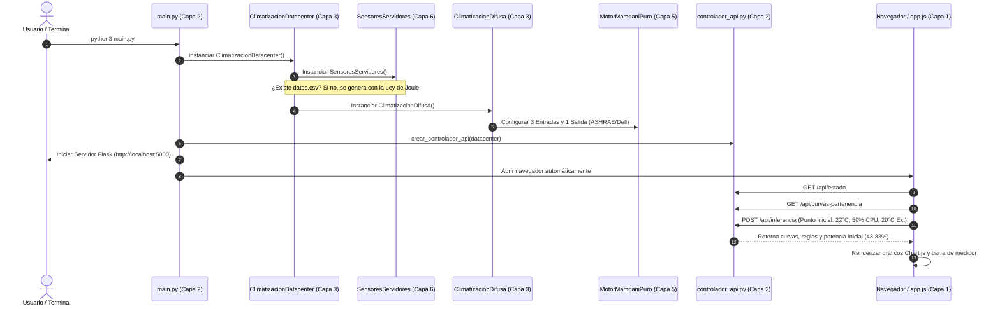
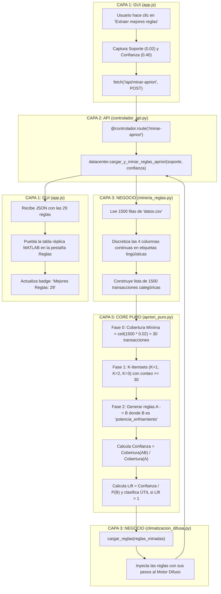
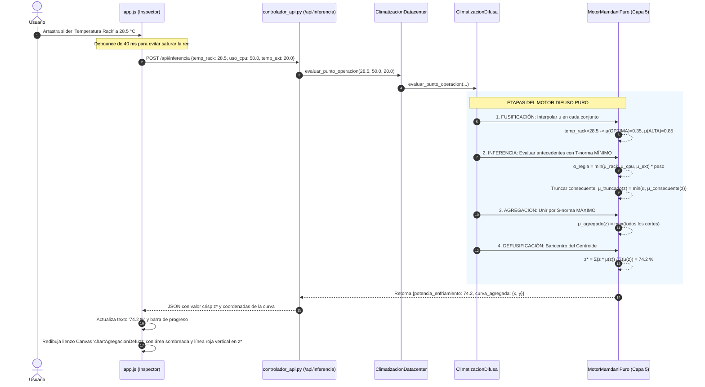
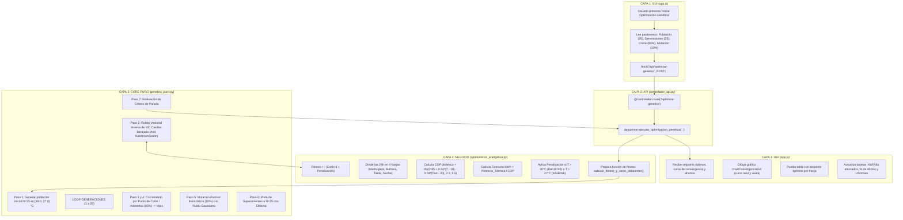
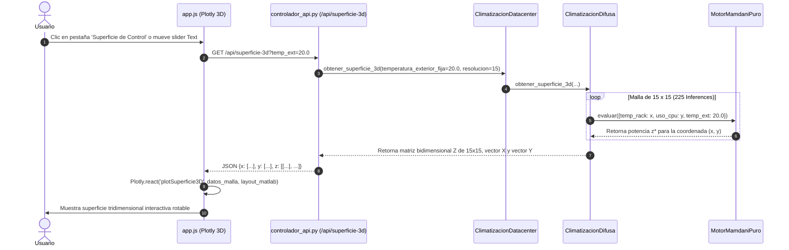

# FLUJO INTEGRAL DEL CÓDIGO PASO A PASO: ARQUITECTURA POR CAPAS

Este documento detalla el **recorrido exacto que sigue el código** a través de cada una de las capas del sistema, desde la interacción del usuario en la interfaz visual hasta el núcleo matemático puro y la persistencia de datos.

---

## 1. Mapa de las 6 Capas de la Arquitectura

El proyecto está diseñado bajo una arquitectura desacoplada en 6 capas claramente diferenciadas:

```
┌─────────────────────────────────────────────────────────────────────────────┐
│  CAPA 1: INTERFAZ DE USUARIO (Frontend / GUI Réplica MATLAB)                │
│  - index.html (Estructura de 3 columnas y 4 pestañas de trabajo)            │
│  - css/matlab_estilo.css (Identidad visual idéntica a MATLAB)               │
│  - js/app.js (Eventos, Debounce, Fetch API, Render Chart.js / Plotly 3D)   │
└─────────────────────────────────────┬───────────────────────────────────────┘
                                      │ HTTP REST (JSON)
                                      ▼
┌─────────────────────────────────────────────────────────────────────────────┐
│  CAPA 2: SERVIDOR WEB Y CONTROLADORES REST (API de Exposición)              │
│  - main.py (Instanciación de Flask, lanzador de navegador)                 │
│  - backend/controladores/controlador_api.py (Endpoints /api/...)            │
└─────────────────────────────────────┬───────────────────────────────────────┘
                                      │ Llamadas a Métodos de Negocio
                                      ▼
┌─────────────────────────────────────────────────────────────────────────────┐
│  CAPA 3: LÓGICA DE NEGOCIO Y DOMINIO (Orquestación del Data Center)         │
│  - backend/negocio/climatizacion_datacenter.py (FACHADA PRINCIPAL)          │
│  - backend/negocio/climatizacion_difusa.py (Variables térmicas ASHRAE/Dell) │
│  - backend/negocio/mineria_reglas.py (Discretización y extracción)          │
│  - backend/negocio/optimizacion_energetica.py (COP del Chiller, $, kWh)     │
└─────────────────────────────────────┬───────────────────────────────────────┘
                                      │ Invocación de Modelos
                                      ▼
┌─────────────────────────────────────────────────────────────────────────────┐
│  CAPA 4: MODELOS Y ADAPTADORES (Capa de Compatibilidad)                     │
│  - backend/modelos/control_difuso.py (Fachada de SKFuzzy compatible)        │
│  - backend/modelos/apriori.py (Adaptador de Minería de Reglas)              │
│  - backend/modelos/algoritmo_genetico.py (Adaptador de Optimización)        │
└─────────────────────────────────────┬───────────────────────────────────────┘
                                      │ Ejecución Algorítmica Pura
                                      ▼
┌─────────────────────────────────────────────────────────────────────────────┐
│  CAPA 5: EL CORE PURO MATEMÁTICO (Núcleo de Inteligencia Artificial)        │
│  - backend/core/motor_difuso_puro.py (4 Etapas: Fusificación -> Centroide)  │
│  - backend/core/apriori_puro.py (Fases 0, 1 y 2: Cobertura, Itemsets, Lift)│
│  - backend/core/genetico_puro.py (Ciclo 7 Pasos, Ruleta 100 Barajada)      │
└─────────────────────────────────────┬───────────────────────────────────────┘
                                      │ Telemetría y Muestreo Físico
                                      ▼
┌─────────────────────────────────────────────────────────────────────────────┐
│  CAPA 6: FUENTES DE DATOS Y SENSORES IoT (Capa de Telemetría Física)        │
│  - backend/fuentes_datos/sensores_servidores.py (Modelo térmico Joule)     │
│  - backend/fuentes_datos/datos.csv (1500 Registros de 24 horas continuas)   │
└─────────────────────────────────────────────────────────────────────────────┘
```

---

## 2. Flujo 1: Arranque e Inicialización del Sistema (Bootstrapping)

¿Qué ocurre en el milisegundo en que se ejecuta `python3 main.py` en la terminal?



### Paso a paso por archivos:
1. **[`main.py`](file:///home/saimoljimenez/Univercidad/IA/ProyectoCLimatico/app_climatizacion/main.py):**
   - Importa `Flask`, `ClimatizacionDatacenter` y `crear_controlador_api`.
   - Localiza la ruta absoluta de [`backend/fuentes_datos/datos.csv`](file:///home/saimoljimenez/Univercidad/IA/ProyectoCLimatico/app_climatizacion/backend/fuentes_datos/datos.csv).
   - Instancia el objeto central `datacenter = ClimatizacionDatacenter(...)`.
2. **[`backend/negocio/climatizacion_datacenter.py`](file:///home/saimoljimenez/Univercidad/IA/ProyectoCLimatico/app_climatizacion/backend/negocio/climatizacion_datacenter.py):**
   - En su método `__init__`, verifica si el archivo `datos.csv` existe. Si no existe, invoca a `self.sensores_servidores.guardar_en_archivo_csv()`.
   - Inicializa el motor difuso `self.climatizacion_difusa = ClimatizacionDifusa()`, el minero `self.mineria_reglas = MineriaReglas()` y el optimizador `self.optimizacion_energetica = OptimizacionEnergetica(...)`.
3. **[`backend/negocio/climatizacion_difusa.py`](file:///home/saimoljimenez/Univercidad/IA/ProyectoCLimatico/app_climatizacion/backend/negocio/climatizacion_difusa.py):**
   - Define los universos de discurso de ingeniería:
     - `temperatura_rack`: $[10, 45]^\circ\text{C}$ con particiones `BAJA`, `OPTIMA`, `ALTA`, `CRITICA`.
     - `uso_cpu`: $[0, 100]\%$ con particiones `BAJO`, `MEDIO`, `ALTO`.
     - `temperatura_exterior`: $[0, 45]^\circ\text{C}$ con particiones `FRIO`, `TEMPLADO`, `CALIDO`.
     - `potencia_enfriamiento`: $[0, 100]\%$ con particiones `MINIMA`, `MEDIA`, `ALTA`, `MAXIMA`.
4. **[`backend/core/motor_difuso_puro.py`](file:///home/saimoljimenez/Univercidad/IA/ProyectoCLimatico/app_climatizacion/backend/core/motor_difuso_puro.py):**
   - Registra en memoria las funciones matemáticas `FuncionesPertenencia.trapezoidal` y `triangular` en arreglos discretos de NumPy para cada variable.
5. **[`frontend/js/app.js`](file:///home/saimoljimenez/Univercidad/IA/ProyectoCLimatico/app_climatizacion/frontend/js/app.js):**
   - El navegador carga `index.html`. El evento `DOMContentLoaded` dispara `app.init()`.
   - Se realizan tres peticiones iniciales en paralelo: `cargarEstadoInicial()`, `cargarCurvasPertenencia()` y `ejecutarInferencia()`.
   - Se instancian los 4 lienzos de Chart.js mostrando las funciones de pertenencia y se dibuja el medidor de refrigeración.

---

## 3. Flujo 2: Minado de Reglas con el Algoritmo A Priori

Este flujo ocurre cuando el usuario hace clic en **"Extraer mejores reglas"** o ajusta los parámetros de **Soporte Mínimo** y **Confianza Mínima** en la barra lateral.



### Detalle de Transformación de Datos en este Flujo:
1. **Lectura de Telemetría:** En [`backend/fuentes_datos/datos.csv`](file:///home/saimoljimenez/Univercidad/IA/ProyectoCLimatico/app_climatizacion/backend/fuentes_datos/datos.csv), una fila cruda contiene:
   `{temp_rack: 28.1, cpu: 78.5, temp_ext: 26.2, potencia: 72.0}`
2. **Discretización Lingüística:** [`mineria_reglas.py`](file:///home/saimoljimenez/Univercidad/IA/ProyectoCLimatico/app_climatizacion/backend/negocio/mineria_reglas.py) convierte esa fila en:
   `{temperatura_rack: "ALTA", uso_cpu: "ALTO", temperatura_exterior: "CALIDO", potencia_enfriamiento: "ALTA"}`
3. **Filtro de Cobertura en [`apriori_puro.py`](file:///home/saimoljimenez/Univercidad/IA/ProyectoCLimatico/app_climatizacion/backend/core/apriori_puro.py):**
   $\text{Cobertura Mínima} = \lceil 1500 \times 0.02 \rceil = 30\text{ transacciones}$.
   Cualquier combinación que ocurra menos de 30 veces es eliminada en la Fase 1.
4. **Evaluación de Confianza y Lift:**
   Se calcula la confianza condicional $P(B \mid A)$. Si supera el $40\%$ ($0.40$), se calcula el $\text{Lift}$. Si $\text{Lift} > 1$, la correlación es positiva y la regla se incorpora al sistema difuso.
5. **Carga en el Motor Difuso:**
   [`climatizacion_difusa.py`](file:///home/saimoljimenez/Univercidad/IA/ProyectoCLimatico/app_climatizacion/backend/negocio/climatizacion_difusa.py) toma el texto y crea la regla con su factor de confianza como ponderador de peso.

---

## 4. Flujo 3: Inferencia en Tiempo Real y Defusificación por Centroide

Este flujo ocurre cuando el usuario arrastra cualquiera de los sliders en el **Inspector Derecho** (`Temperatura Rack`, `Uso CPU` o `Temperatura Exterior`).



### Matemáticas exactas ejecutadas en la Capa 5 ([`motor_difuso_puro.py`](file:///home/saimoljimenez/Univercidad/IA/ProyectoCLimatico/app_climatizacion/backend/core/motor_difuso_puro.py)):
1. **Fusificación:**
   ```python
   grado = float(np.interp(valor_x, self.universo, curva))
   ```
2. **Inferencia (Operador Mínimo):**
   ```python
   alfa_activacion = float(np.min(grados_antecedentes)) * self.peso_confianza
   mf_truncada = np.minimum(alfa_activacion, mf_consecuente)
   ```
3. **Agregación (Operador Máximo):**
   ```python
   curva_agregada = np.maximum.reduce(cortes_reglas)
   ```
4. **Defusificación por Centroide:**
   ```python
   momento_estatico = float(np.sum(universo * curva_agregada))
   area_total = float(np.sum(curva_agregada))
   centroide_z = momento_estatico / area_total
   ```

---

## 5. Flujo 4: Optimización Energética con Algoritmo Genético

Este flujo ocurre cuando el usuario hace clic en el botón **"Iniciar Optimización Genética"** en la pestaña *Algoritmo Genético*.



### Detalle de la Ruleta Vectorial de 100 Casillas en [`genetico_puro.py`](file:///home/saimoljimenez/Univercidad/IA/ProyectoCLimatico/app_climatizacion/backend/core/genetico_puro.py):
1. **Inversión de Aptitud:**
   $$\text{Aptitud Invertida}_i = (\text{Costo Máximo} + \delta) - \text{Costo Actual}_i$$
2. **Vector de 100 Posiciones:** Cada individuo recibe un número de casillas proporcional a su porcentaje de probabilidad redondeado, sumando estrictamente 100.
3. **Barajado (*Shuffling*):** `np.random.shuffle(vector_100)` para destruir cualquier contigüidad espacial.
4. **Anti-Autofecundación:** Si `posicion_p2 == posicion_p1`, se reintenta hasta 30 veces la extracción estocástica para garantizar diversidad genética.

---

## 6. Flujo 5: Generación de la Superficie de Control 3D

Este flujo se activa al ingresar a la pestaña **"Superficie de Control"** o al mover el slider de `Temperatura Exterior Fija`.



---

## 7. Resumen de Responsabilidades por Archivo

| Capa | Archivo | Responsabilidad Principal |
| :--- | :--- | :--- |
| **Capa 1: GUI** | [`frontend/index.html`](file:///home/saimoljimenez/Univercidad/IA/ProyectoCLimatico/app_climatizacion/frontend/index.html) | Esqueleto visual con réplica de MATLAB Fuzzy Logic Designer (3 columnas, 4 tabs). |
| **Capa 1: GUI** | [`frontend/js/app.js`](file:///home/saimoljimenez/Univercidad/IA/ProyectoCLimatico/app_climatizacion/frontend/js/app.js) | Manejo de eventos del DOM, debounce de sliders, peticiones HTTP fetch y gráficos Chart.js / Plotly. |
| **Capa 2: API** | [`main.py`](file:///home/saimoljimenez/Univercidad/IA/ProyectoCLimatico/app_climatizacion/main.py) | Punto de entrada ejecutable, servidor web Flask y apertura automática de navegador. |
| **Capa 2: API** | [`backend/controladores/controlador_api.py`](file:///home/saimoljimenez/Univercidad/IA/ProyectoCLimatico/app_climatizacion/backend/controladores/controlador_api.py) | Endpoints REST `/api/estado`, `/api/minar-apriori`, `/api/inferencia`, `/api/optimizar-genetico`, etc. |
| **Capa 3: Negocio** | [`backend/negocio/climatizacion_datacenter.py`](file:///home/saimoljimenez/Univercidad/IA/ProyectoCLimatico/app_climatizacion/backend/negocio/climatizacion_datacenter.py) | **Fachada Principal** que unifica Minería, Lógica Difusa y Algoritmo Genético. |
| **Capa 3: Negocio** | [`backend/negocio/climatizacion_difusa.py`](file:///home/saimoljimenez/Univercidad/IA/ProyectoCLimatico/app_climatizacion/backend/negocio/climatizacion_difusa.py) | Parametrización de los conjuntos difusos según ASHRAE TC 9.9 y manuales Dell R740. |
| **Capa 3: Negocio** | [`backend/negocio/mineria_reglas.py`](file:///home/saimoljimenez/Univercidad/IA/ProyectoCLimatico/app_climatizacion/backend/negocio/mineria_reglas.py) | Lectura del CSV con librería estándar y discretización en categorías lingüísticas. |
| **Capa 3: Negocio** | [`backend/negocio/optimizacion_energetica.py`](file:///home/saimoljimenez/Univercidad/IA/ProyectoCLimatico/app_climatizacion/backend/negocio/optimizacion_energetica.py) | Función de costo termodinámica con COP dinámico de compresión de vapor y penalización. |
| **Capa 4: Modelos** | [`backend/modelos/control_difuso.py`](file:///home/saimoljimenez/Univercidad/IA/ProyectoCLimatico/app_climatizacion/backend/modelos/control_difuso.py) | Adaptador de compatibilidad de API para el motor difuso. |
| **Capa 4: Modelos** | [`backend/modelos/apriori.py`](file:///home/saimoljimenez/Univercidad/IA/ProyectoCLimatico/app_climatizacion/backend/modelos/apriori.py) | Adaptador de datos y enlace al algoritmo Apriori puro. |
| **Capa 4: Modelos** | [`backend/modelos/algoritmo_genetico.py`](file:///home/saimoljimenez/Univercidad/IA/ProyectoCLimatico/app_climatizacion/backend/modelos/algoritmo_genetico.py) | Adaptador del optimizador evolutivo. |
| **Capa 5: Core Puro** | [`backend/core/motor_difuso_puro.py`](file:///home/saimoljimenez/Univercidad/IA/ProyectoCLimatico/app_climatizacion/backend/core/motor_difuso_puro.py) | **Las 4 etapas matemáticas:** Fusificación, Inferencia con AND Mínimo, Agregación Máxima y Centroide. |
| **Capa 5: Core Puro** | [`backend/core/apriori_puro.py`](file:///home/saimoljimenez/Univercidad/IA/ProyectoCLimatico/app_climatizacion/backend/core/apriori_puro.py) | **Las 3 fases de minería:** Fase 0 (Cobertura mínima), Fase 1 (Itemsets K=1,2,3), Fase 2 (Confianza y Lift). |
| **Capa 5: Core Puro** | [`backend/core/genetico_puro.py`](file:///home/saimoljimenez/Univercidad/IA/ProyectoCLimatico/app_climatizacion/backend/core/genetico_puro.py) | **Ciclo de 7 pasos:** Población inicial, Ruleta de 100 casillas barajada, Cruce, Mutación y Poda N. |
| **Capa 6: Datos** | [`backend/fuentes_datos/sensores_servidores.py`](file:///home/saimoljimenez/Univercidad/IA/ProyectoCLimatico/app_climatizacion/backend/fuentes_datos/sensores_servidores.py) | Generador físico estocástico con Ley de Joule, oscilación diurna y disipación de servidores. |
| **Capa 6: Datos** | [`backend/fuentes_datos/datos.csv`](file:///home/saimoljimenez/Univercidad/IA/ProyectoCLimatico/app_climatizacion/backend/fuentes_datos/datos.csv) | Archivo CSV persistido con las 1500 lecturas IoT en intervalos de 1 minuto. |
