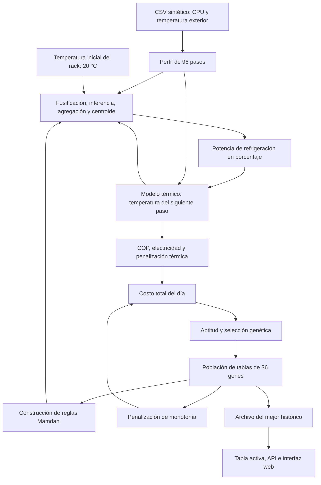

# Climatización de un centro de datos con lógica difusa y algoritmo genético

Este proyecto universitario estudia cómo enfriar un centro de datos con menor costo eléctrico y térmico.\
Un controlador difuso Mamdani decide la potencia de refrigeración en cada paso de una simulación.\
Un algoritmo genético busca los consecuentes de una tabla de 36 reglas para ese controlador.\
La evaluación utiliza datos sintéticos y un modelo térmico de 24 horas, sin conexión a equipos reales.\
Los experimentos documentados comparan la búsqueda con controles proporcionales y explicitan sus limitaciones.

**Código documentado:** `06cc1c9a1b0b5206e1726f48c74613830c3c1c18`, rama `feature-sin-apriori`. **Fecha:** 30 de septiembre de 2026, zona America/Guayaquil. El código se mantuvo congelado durante la documentación.

Las etiquetas tienen una base estricta: **[ENSEÑADO EN CLASE]** identifica únicamente lo incluido en la lista de requisitos del docente suministrada para esta documentación; **[PROPUESTA DEL EQUIPO]** identifica las decisiones concretas del proyecto. La presencia de una constante en el código verifica su valor implementado, no su respaldo físico o normativo.

### Referencias al código

Las citas `ALIAS:inicio–fin` indican archivo y líneas del commit citado. Los resultados experimentales tienen su procedimiento en las secciones 8 y 10.

| Alias | Archivo |
|---|---|
| AG | [backend/modelos/algoritmo_genetico.py](backend/modelos/algoritmo_genetico.py) |
| OE | [backend/negocio/optimizacion_energetica.py](backend/negocio/optimizacion_energetica.py) |
| CD | [backend/negocio/climatizacion_difusa.py](backend/negocio/climatizacion_difusa.py) |
| CT | [backend/modelos/control_difuso.py](backend/modelos/control_difuso.py) |
| DC | [backend/negocio/climatizacion_datacenter.py](backend/negocio/climatizacion_datacenter.py) |
| SS | [backend/fuentes_datos/sensores_servidores.py](backend/fuentes_datos/sensores_servidores.py) |
| API | [backend/controladores/controlador_api.py](backend/controladores/controlador_api.py) |
| MAIN | [main.py](main.py) |
| HTML | [frontend/index.html](frontend/index.html) |
| JS | [frontend/js/app.js](frontend/js/app.js) |

## 2. Problema y objetivo

**[PROPUESTA DEL EQUIPO]** El único problema es enfriar el centro de datos gastando lo mínimo sin superar los límites térmicos adoptados por el modelo. Se representa mediante el costo total diario, que suma electricidad, penalización térmica y penalización de monotonía. Los límites son objetivos penalizados, no restricciones duras: el algoritmo puede devolver temperaturas superiores a 27 °C. No se afirma cumplimiento normativo real. Referencias: OE:174–227.

**[ENSEÑADO EN CLASE]** El proyecto integra algoritmo genético y lógica difusa; se permite usar el genético para generar reglas u optimizar el costo de climatización. **[PROPUESTA DEL EQUIPO]** Aquí el difuso controla cada paso y el genético descubre los 36 consecuentes; no busca consignas de temperatura ni cambia las pertenencias. Referencias: AG:245–268; OE:123–169; CD:18–89.

## 3. Arquitectura y flujo completo

**[PROPUESTA DEL EQUIPO]** La aplicación Flask coordina una simulación y una interfaz de demostración. La temperatura inicial del rack es **20 °C**. En el lazo cerrado, la temperatura del rack la calcula el modelo térmico; **no se toma de la columna de rack del CSV**. Referencias: MAIN:18–25; DC:35–54; OE:146–178.



| Punto solicitado | Implementación y decisión |
|---|---|
| 1. Datos de entrada | **[PROPUESTA DEL EQUIPO]** CPU y exterior del perfil; rack calculado en el paso anterior. OE:154–165. |
| 2. Procesamiento | **[PROPUESTA DEL EQUIPO]** Selección de 96 filas; recorte del exterior y del rack de entrada a sus universos. OE:101–119, 157–165. |
| 3. Técnica de IA | **[ENSEÑADO EN CLASE]** Mamdani multimodal con centroide y algoritmo genético. **[PROPUESTA DEL EQUIPO]** Tres entradas y cromosoma de 36 consecuentes. CD:18–89; OE:91–96. |
| 4. Decisión | **[PROPUESTA DEL EQUIPO]** Potencia porcentual obtenida por inferencia; en la búsqueda se seleccionan tablas mediante ruleta. OE:167–172; AG:163–178. |
| 5. Salida | **[PROPUESTA DEL EQUIPO]** Potencia, trayectoria térmica, costos y tabla histórica seleccionada. OE:229–245; AG:291–297. |
| 6. Aplicación al sistema | **[PROPUESTA DEL EQUIPO]** La potencia extrae calor en un modelo matemático; no acciona un chiller físico. OE:175–178. |
| 7. Retroalimentación | **[PROPUESTA DEL EQUIPO]** Lazo interno: la nueva temperatura alimenta el siguiente paso. Lazo externo: el costo del día determina la aptitud para la ruleta y nuevas tablas. OE:154–178; AG:135–157, 259–282. |

Al arrancar se carga la tabla por defecto. Después de optimizar, la mejor tabla se copia al controlador activo y se sincronizan reglas, inferencia y superficie. Referencia: DC:50–70, 128–145. Esta coordinación es **[PROPUESTA DEL EQUIPO]**.

## 4. Datos

**[PROPUESTA DEL EQUIPO]** `datos.csv` es sintético. `SensoresServidores` usa por defecto 1.500 registros y semilla NumPy 42; reparte 24 horas con `linspace(..., endpoint=False)`. El intervalo previo al redondeo es 57,6 s. No son lecturas de sensores ni evidencia empírica de un centro de datos. Referencia: SS:8–23.

La carga CPU suma una base de 20 %, dos picos gaussianos de amplitudes 35 y 40, centros 11 y 15,5 h y anchos 2,4 y 2,6 h, eventos de estrés y ruido de desviación 5; se recorta a [5,100]. El estrés tiene probabilidad 0,30 entre 13,5 y 17,5 h y añade 32 puntos de CPU. El exterior combina media 21 °C, seno de amplitud 11,5 °C desplazado 9 h, ruido de desviación 1,5 °C y +5 °C en estrés, con recorte [7,42]. Referencias: SS:25–52. Todos estos parámetros son **[PROPUESTA DEL EQUIPO]**, pendientes de contrastar con registros reales: fuente F22.

La columna de rack del generador es una combinación algebraica `15.5 + 14.5·CPU/100 + 0.30·(exterior−20) + 4·estrés + ruido(σ=0.8)`, recortada a [12,40]. La potencia sintética se genera por bandas de rack, con fórmulas, ruido y recortes [5,28], [30,58], [60,83] y [85,100]. Ambas columnas se guardan a dos decimales, pero **no entrenan una regresión ni alimentan el lazo cerrado**. Referencias: SS:54–102; OE:154–165. Decisión: **[PROPUESTA DEL EQUIPO]**.

| Columna | Unidad | Papel en la optimización |
|---|---|---|
| `hora_del_dia_formato_24h` | h | Metadato del CSV; el simulador usa su propio paso temporal. |
| `porcentaje_uso_procesador` | % | Entrada difusa y carga del modelo térmico. |
| `temperatura_ambiental_exterior_celsius` | °C | Entrada difusa, intercambio térmico y COP. |
| `temperatura_rack_celsius` | °C | Solo dato sintético descriptivo; no se usa como rack del lazo cerrado. |
| `potencia_sistema_enfriamiento_porcentaje` | % | Solo acción sintética descriptiva; no determina la salida del controlador. |

**[PROPUESTA DEL EQUIPO]** El perfil se obtiene con `indices = np.linspace(0, len(df)-1, 96, dtype=int)` y `df.iloc[indices]`; no hay promedios por cuarto de hora ni interpolación temporal. Cada fila elegida se interpreta como un paso de 0,25 h. El CSV llega a 23,98 h, mientras la API etiqueta los pasos con `i·0.25`, hasta 23,75 h; las temperaturas registradas son posteriores a la actualización de cada paso. Referencias: OE:26–27, 108–111, 178, 203, 394. La alineación exacta de marcas temporales es un pendiente.

Si falta el CSV, `OptimizacionEnergetica` construye un perfil simplificado sin ruido ni eventos; el arranque de `ClimatizacionDatacenter`, en cambio, genera el CSV si no existe. Son rutas distintas, ambas **[PROPUESTA DEL EQUIPO]**. Referencias: OE:112–119; DC:41–43.

El CSV contiene **1500 filas** y se verificó igualdad exacta con `SensoresServidores().generar_historial()` usando sus valores por defecto. El perfil usado en esta documentación tiene 96 filas.

| Columna del perfil | Mínimo | Máximo | Media | Mediana |
| --- | --- | --- | --- | --- |
| hora_del_dia_formato_24h | 0,000 | 23,980 | 11,984 | 11,985 |
| porcentaje_uso_procesador | 7,500 | 100,000 | 41,944 | 34,590 |
| temperatura_ambiental_exterior_celsius | 7,000 | 40,100 | 21,302 | 21,465 |
| temperatura_rack_celsius | 12,860 | 39,680 | 22,305 | 21,055 |
| potencia_sistema_enfriamiento_porcentaje | 11,530 | 99,400 | 45,773 | 41,795 |

SHA-256 del CSV usado: `2911431d52b20a9b3f73f074c88f9b20132bfa9d7a24b3ad925871e62a2c0bd1`. Los valores de rack/potencia de esta tabla describen el CSV, no las trayectorias del controlador.


## 5. Sistema difuso

**[ENSEÑADO EN CLASE]** Sistema Mamdani con dos o más entradas, las cuatro fases y centroide; uso de `Antecedent`, `Consequent`, `Rule`, `ControlSystem` y `ControlSystemSimulation`. **[PROPUESTA DEL EQUIPO]** Se eligieron tres entradas, salida física porcentual, trapecios y triángulos concretos. Referencias: CT:20–28, 65–72, 105–112, 139–161; CD:18–89.

| Variable | Papel | Universo y paso | Decisión y justificación pendiente |
|---|---|---|---|
| `temperatura_rack` | Entrada | 10–45 °C, paso 0,5 | [PROPUESTA DEL EQUIPO]; F01. CD:18–34. |
| `uso_cpu` | Entrada | 0–100 %, paso 1 | [PROPUESTA DEL EQUIPO]; F02. CD:38–51. |
| `temperatura_exterior` | Entrada | 0–45 °C, paso 0,5 | [PROPUESTA DEL EQUIPO]; F03. CD:55–68. |
| `potencia_enfriamiento` | Salida | 0–100 %, paso 1 | [PROPUESTA DEL EQUIPO]; F04. CD:72–89. |

Los parámetros siguientes están implementados, pero no se encontró una justificación experta, encuesta o datasheet verificada para ellos. **[ENSEÑADO EN CLASE]** El docente exige justificar esos valores; esa evidencia sigue pendiente. Triángulos/trapecios se seleccionan automáticamente según tres/cuatro puntos: CT:45–68. Los trapecios representan bandas y hombros; los triángulos un pico y transiciones lineales: razón de diseño **[PROPUESTA DEL EQUIPO]**, no prueba de optimalidad.

| Variable | Conjunto | Tipo | Parámetros | Justificación/fuente |
|---|---|---|---|---|
| Rack | BAJA | Trapezoidal | [10,10,14.5,18] | [PROPUESTA DEL EQUIPO]; [COMPLETAR FUENTE: F01, universo y pertenencias del rack]. CD:25. |
| Rack | OPTIMA | Trapezoidal | [16.5,18,24.5,27] | [PROPUESTA DEL EQUIPO]; F01. CD:28. |
| Rack | ALTA | Triangular | [24.5,28.5,30.5] | [PROPUESTA DEL EQUIPO]; F01. CD:31. |
| Rack | CRITICA | Trapezoidal | [29.5,31,45,45] | [PROPUESTA DEL EQUIPO]; F01. CD:34. |
| CPU | BAJO | Trapezoidal | [0,0,20,35] | [PROPUESTA DEL EQUIPO]; [COMPLETAR FUENTE: F02, pertenencias CPU]. CD:45. |
| CPU | MEDIO | Triangular | [25,50,75] | [PROPUESTA DEL EQUIPO]; F02. CD:48. |
| CPU | ALTO | Trapezoidal | [65,80,100,100] | [PROPUESTA DEL EQUIPO]; F02. CD:51. |
| Exterior | FRIO | Trapezoidal | [0,0,12,17] | [PROPUESTA DEL EQUIPO]; [COMPLETAR FUENTE: F03, universo y pertenencias del exterior]. CD:62. |
| Exterior | TEMPLADO | Triangular | [14,20,26] | [PROPUESTA DEL EQUIPO]; F03. CD:65. |
| Exterior | CALIDO | Trapezoidal | [23,28,45,45] | [PROPUESTA DEL EQUIPO]; F03. CD:68. |
| Refrigeración | MINIMA | Trapezoidal | [0,0,15,30] | [PROPUESTA DEL EQUIPO]; [COMPLETAR FUENTE: F04, pertenencias y respuesta del actuador]. CD:80. |
| Refrigeración | MEDIA | Triangular | [20,45,65] | [PROPUESTA DEL EQUIPO]; F04. CD:83. |
| Refrigeración | ALTA | Triangular | [55,75,90] | [PROPUESTA DEL EQUIPO]; F04. CD:86. |
| Refrigeración | MAXIMA | Trapezoidal | [80,88,100,100] | [PROPUESTA DEL EQUIPO]; F04. CD:89. |

**[PROPUESTA DEL EQUIPO]** Las entradas se conservan en °C y %, sin normalizarlas a un intervalo común; los universos se definieron en esas unidades. El grado de pertenencia sí está entre 0 y 1, lo cual no equivale a normalizar la entrada. La salida permanece en porcentaje físico. Referencias: CT:20–28, 83–91; OE:163–176. **[ENSEÑADO EN CLASE]** Normalizar entradas es permitido, no obligatorio; la salida no se normaliza.

### Cuatro pasos y ejemplo calculado a mano

**[ENSEÑADO EN CLASE]** Las fases son fusificación, inferencia, agregación y defusificación por centroide. **[PROPUESTA DEL EQUIPO]** Se usan las operaciones por defecto del motor: AND mínimo, acumulación máximo y recorte del consecuente; todas las reglas actuales tienen peso unitario. Referencias: OE:128–137; CD:114–119; CT:187–207. La aplicación delega el cómputo a skfuzzy: CT:158–161.

Ejemplo con **tabla por defecto**, rack 20 °C, CPU 50 % y exterior 20 °C, sin evolución genética:

1. **Fusificación:** rack OPTIMA = 1 (20 está en [18,24.5]); CPU MEDIO = 1 (pico 50); exterior TEMPLADO = 1 (pico 20). Los otros conjuntos tienen grado 0. Parámetros: CD:25–68.
2. **Inferencia:** solo se activa `OPTIMA AND MEDIO AND TEMPLADO`, con `min(1,1,1)=1`. Corresponde al gen 13, regla 14 de la API. Su consecuente por defecto es MEDIA, gen = 1. Referencias: OE:92–96; DC:17–25.
3. **Agregación:** el único consecuente recortado a altura 1 es el triángulo MEDIA [20,45,65]; el máximo con los otros aportes nulos deja ese triángulo.
4. **Centroide:** el área es `(65−20)/2 = 22.5`; su primer momento es 975 y `z*=975/22.5=(20+45+65)/3=43.333333… %`. El simulador devolvió **43.33333333333333 %**; el controlador usado por `/api/inferencia` redondeó a **43,33 %**. Referencias: CD:83; CT:158–161. Verificación ejecutada también mediante la API de prueba.

### Tablas de reglas

**[PROPUESTA DEL EQUIPO]** Los antecedentes son las 4×3×3 combinaciones, con exterior variando más rápido: `índice = 9·rack + 3·cpu + exterior`, usando índices desde cero. La API enumera reglas desde uno. El gen indica únicamente el consecuente: 0 MINIMA, 1 MEDIA, 2 ALTA, 3 MAXIMA. Referencias: OE:91–96, 128–134; CD:106–136.

La mejor tabla de las diez corridas fue la de semilla **303**, seleccionada por el costo archivado del entrenamiento, **33,89 USD/día**. No es un óptimo demostrado ni una tabla almacenada de forma permanente por el servidor.

Cromosoma obtenido:

```text
[0, 1, 0, 2, 0, 0, 1, 1, 0, 0, 1, 1, 2, 0, 0, 1, 1, 0, 1, 2, 3, 2, 3, 3, 1, 1, 2, 2, 2, 3, 2, 3, 3, 3, 3, 2]
```

Tabla por defecto, tomada directamente de DC:17–26:

```text
[0, 0, 0, 0, 0, 1, 0, 1, 1, 0, 0, 1, 1, 1, 2, 1, 2, 2, 1, 1, 2, 2, 2, 3, 2, 3, 3, 2, 3, 3, 3, 3, 3, 3, 3, 3]
```

La tabla completa muestra ambas soluciones. Leer cada fila como «SI rack es … Y CPU es … Y exterior es … ENTONCES refrigeración es …». Ambas elecciones son **[PROPUESTA DEL EQUIPO]**.

| Gen | Regla API | Rack | CPU | Exterior | Mejor: gen y consecuente | Por defecto: gen y consecuente |
| --- | --- | --- | --- | --- | --- | --- |
| 0 | 1 | BAJA | BAJO | FRIO | 0 MINIMA | 0 MINIMA |
| 1 | 2 | BAJA | BAJO | TEMPLADO | 1 MEDIA | 0 MINIMA |
| 2 | 3 | BAJA | BAJO | CALIDO | 0 MINIMA | 0 MINIMA |
| 3 | 4 | BAJA | MEDIO | FRIO | 2 ALTA | 0 MINIMA |
| 4 | 5 | BAJA | MEDIO | TEMPLADO | 0 MINIMA | 0 MINIMA |
| 5 | 6 | BAJA | MEDIO | CALIDO | 0 MINIMA | 1 MEDIA |
| 6 | 7 | BAJA | ALTO | FRIO | 1 MEDIA | 0 MINIMA |
| 7 | 8 | BAJA | ALTO | TEMPLADO | 1 MEDIA | 1 MEDIA |
| 8 | 9 | BAJA | ALTO | CALIDO | 0 MINIMA | 1 MEDIA |
| 9 | 10 | OPTIMA | BAJO | FRIO | 0 MINIMA | 0 MINIMA |
| 10 | 11 | OPTIMA | BAJO | TEMPLADO | 1 MEDIA | 0 MINIMA |
| 11 | 12 | OPTIMA | BAJO | CALIDO | 1 MEDIA | 1 MEDIA |
| 12 | 13 | OPTIMA | MEDIO | FRIO | 2 ALTA | 1 MEDIA |
| 13 | 14 | OPTIMA | MEDIO | TEMPLADO | 0 MINIMA | 1 MEDIA |
| 14 | 15 | OPTIMA | MEDIO | CALIDO | 0 MINIMA | 2 ALTA |
| 15 | 16 | OPTIMA | ALTO | FRIO | 1 MEDIA | 1 MEDIA |
| 16 | 17 | OPTIMA | ALTO | TEMPLADO | 1 MEDIA | 2 ALTA |
| 17 | 18 | OPTIMA | ALTO | CALIDO | 0 MINIMA | 2 ALTA |
| 18 | 19 | ALTA | BAJO | FRIO | 1 MEDIA | 1 MEDIA |
| 19 | 20 | ALTA | BAJO | TEMPLADO | 2 ALTA | 1 MEDIA |
| 20 | 21 | ALTA | BAJO | CALIDO | 3 MAXIMA | 2 ALTA |
| 21 | 22 | ALTA | MEDIO | FRIO | 2 ALTA | 2 ALTA |
| 22 | 23 | ALTA | MEDIO | TEMPLADO | 3 MAXIMA | 2 ALTA |
| 23 | 24 | ALTA | MEDIO | CALIDO | 3 MAXIMA | 3 MAXIMA |
| 24 | 25 | ALTA | ALTO | FRIO | 1 MEDIA | 2 ALTA |
| 25 | 26 | ALTA | ALTO | TEMPLADO | 1 MEDIA | 3 MAXIMA |
| 26 | 27 | ALTA | ALTO | CALIDO | 2 ALTA | 3 MAXIMA |
| 27 | 28 | CRITICA | BAJO | FRIO | 2 ALTA | 2 ALTA |
| 28 | 29 | CRITICA | BAJO | TEMPLADO | 2 ALTA | 3 MAXIMA |
| 29 | 30 | CRITICA | BAJO | CALIDO | 3 MAXIMA | 3 MAXIMA |
| 30 | 31 | CRITICA | MEDIO | FRIO | 2 ALTA | 3 MAXIMA |
| 31 | 32 | CRITICA | MEDIO | TEMPLADO | 3 MAXIMA | 3 MAXIMA |
| 32 | 33 | CRITICA | MEDIO | CALIDO | 3 MAXIMA | 3 MAXIMA |
| 33 | 34 | CRITICA | ALTO | FRIO | 3 MAXIMA | 3 MAXIMA |
| 34 | 35 | CRITICA | ALTO | TEMPLADO | 3 MAXIMA | 3 MAXIMA |
| 35 | 36 | CRITICA | ALTO | CALIDO | 2 ALTA | 3 MAXIMA |


## 6. Algoritmo genético

**[ENSEÑADO EN CLASE]** Se permite generar reglas con población inicial y función de aptitud. **[PROPUESTA DEL EQUIPO]** Cada individuo es la lista de 36 genes definida en la sección 5; las funciones de pertenencia permanecen fijas. Referencias: AG:6–14, 245; OE:85–96, 128–131.

| Paso del esquema de clase | Función y archivo:líneas | Clasificación |
|---|---|---|
| 1. Población inicial | `generar_poblacion_inicial`, AG:107–130 | [ENSEÑADO EN CLASE] existencia de población; [PROPUESTA DEL EQUIPO] generación guiada. |
| 2. Evaluación de aptitud | `evaluar_poblacion`, AG:135–158; `simular_dia`, OE:139–245 | [ENSEÑADO EN CLASE] evaluación; [PROPUESTA DEL EQUIPO] costo, escalado y caché. |
| 3. Ruleta probabilística | `seleccion_por_ruleta`, AG:163–178 | [ENSEÑADO EN CLASE] ruleta; [PROPUESTA DEL EQUIPO] escalado y reemplazo. |
| 4. Cruce en un punto | `cruce_un_punto`, AG:183–192 | [ENSEÑADO EN CLASE] operador; [PROPUESTA DEL EQUIPO] se aplica siempre una vez por generación y produce dos hijos. AG:261–265. |
| 5. Mutación de individuo y gen | `mutacion`, AG:197–219 | [ENSEÑADO EN CLASE] evento con probabilidad fija; [PROPUESTA DEL EQUIPO] valor 0,20 y dominio crítico. |
| 6. Sobrevivientes al azar hasta N | `seleccion_sobrevivientes`, AG:224–235 | [ENSEÑADO EN CLASE] poda al azar, sin selección elitista. |
| 7. Ciclo y parada | `optimizar`, AG:240–297 | [PROPUESTA DEL EQUIPO] coordinación del ciclo y parada por generaciones; no se atribuye ese criterio de parada a la lista docente suministrada. |

| Parámetro | Valor por defecto | Efecto y decisión |
|---|---:|---|
| Población N | 20 | [PROPUESTA DEL EQUIPO] candidatos mantenidos; cambia diversidad inicial y costo de evaluación. AG:63, 97–100; F24. |
| Generaciones G | 20 | [PROPUESTA DEL EQUIPO] ciclos, con dos hijos por ciclo; no significa 20 poblaciones nuevas completas. AG:64, 259–265; F24. |
| Probabilidad de mutación | 0,20 | [PROPUESTA DEL EQUIPO] una decisión por generación, no una probabilidad por cada gen. AG:65, 205–219; F24. |
| Factor delta de ruleta | 0,1 | [PROPUESTA DEL EQUIPO] fracción del rango de costos añadida a los pesos. AG:66, 152–155; F24. |
| Piso del peso de ruleta | 0,001 | [PROPUESTA DEL EQUIPO] mantiene pesos positivos incluso con costos iguales. AG:155; F24. |
| Corte | Uniforme de 1 a 35 | [ENSEÑADO EN CLASE] cruce en un punto; [PROPUESTA DEL EQUIPO] dominio del corte para 36 genes. AG:188–191. |

La API acepta `tasa_cruce`, pero se pasa a `**kwargs` y no modifica el cruce: API:91, 97; DC:130–137; OE:323–335. No hay semilla configurada por la interfaz; para reproducir el protocolo se usa el fragmento de la sección 10. Son características **[PROPUESTA DEL EQUIPO]**, no requisitos docentes.

### Dos aptitudes

**[PROPUESTA DEL EQUIPO]** La aptitud absoluta es `A=1/(1+Ctotal)`, donde `Ctotal=Celectricidad+Ptérmica+Pmonotonía` (OE:225–231). Se devuelve como medida del resultado; el evaluador también entrega detalles redondeados. El genético ignora la primera aptitud de la tupla y extrae `detalles["costo_total"]` para seleccionar: AG:145–147.

La ruleta utiliza `Wi=max(0.001, (Cmax−Ci)+0.1·(Cmax−Cmin))` y `pi=Wi/ΣW`. Con costos iguales todos reciben 0,001 y las probabilidades son uniformes. Los dos sorteos permiten el mismo padre. Referencias: AG:150–176. La razón propuesta es ampliar las diferencias de pesos respecto de `1/(1+C)`; no se demostró que ese escalado sea el mejor para este problema.

Los historiales de aptitud máxima/media usan W, mientras `mejor_aptitud` usa A; no deben compararse como la misma escala. Además, la poda elimina pesos e individuos sin recalcular el escalado: la ruleta siguiente conserva los extremos de la población ampliada previa. Referencias: AG:271–293. Ambas características son **[PROPUESTA DEL EQUIPO]**.

### Diferencias respecto al algoritmo visto en clase

Los motivos de esta tabla son razones de diseño, no demostraciones de mejora experimental.

| Diferencia | Motivo y referencia | Etiqueta |
|---|---|---|
| Población inicial guiada, no independiente | Empezar con secuencias no decrecientes para cada CPU/exterior; BAJA y OPTIMA también tienen dominios iniciales reducidos. AG:117–128. | [PROPUESTA DEL EQUIPO] |
| Genes 27–35 en {2,3} | Imponer refrigeración ALTA/MAXIMA en CRITICA; el cruce la hereda y la mutación la preserva. AG:123, 185–191, 212–218. Falta validación experta: F01/F04/F06/F20. | [PROPUESTA DEL EQUIPO] |
| Penalización de monotonía de 5 USD | Desfavorecer descensos de potencia al aumentar rack con CPU/exterior fijos; se comparan 27 pares adyacentes. OE:206–226; F19. | [PROPUESTA DEL EQUIPO] |
| Aptitud escalada | Modificar la presión de selección con diferencias relativas de costo y piso positivo. AG:150–157; F24. | [PROPUESTA DEL EQUIPO] |
| Ruleta con reemplazo | Dos sorteos independientes y posible auto-cruce. AG:175–176. | [PROPUESTA DEL EQUIPO] |
| Caché de evaluaciones | Evitar volver a simular un genotipo; presupone evaluación repetible, supuesto cuestionado por el diagnóstico de la sección 9. AG:141–147, 244. | [PROPUESTA DEL EQUIPO] |
| Archivo del mejor histórico | Conservar el resultado para devolución aunque la poda lo elimine; no lo protege dentro de la población reproductiva. AG:248–253, 273–282, 291–297. | [PROPUESTA DEL EQUIPO] |
| Redondeo a centavos | Comparar el costo monetario reportado; puede crear empates entre costos sin redondear. OE:231; AG:147, 275–276. | [PROPUESTA DEL EQUIPO] |
| Pesos conservados después de la poda | Reutilizar la lista de pesos tras eliminar posiciones; no se reescala el conjunto restante. AG:271–282. | [PROPUESTA DEL EQUIPO] |
| Mejor histórico antes de sobrevivientes y parada por G | El resultado puede ser una tabla que no sobrevive; G es un límite fijo de trabajo elegido por el equipo. AG:259, 273–297. | [PROPUESTA DEL EQUIPO] |

## 7. Modelo de simulación y constantes

Todos los modelos y valores específicos de esta sección son **[PROPUESTA DEL EQUIPO]**. Las fuentes F01–F27 se detallan en la sección 12; ninguna fuente física externa se declara verificada en esta documentación.

### Balance térmico, electricidad y costo

Con CPU `u` en %, exterior `E`, rack `T` y refrigeración `p` en %:

```text
Qgenerado = 30 + 52·u/100 + 0.8·(E−T)                  [kW]
Qextraído = 1.40·p                                     [kW]
Tsiguiente = T + 0.25·(Qgenerado−Qextraído)/8            [°C]
COP = clip(2.85 + 0.24·(Tsiguiente−18)
                 − 0.04·(E−20), 2.2, 5.5)
Epaso = (Qextraído/COP)·0.25                           [kWh]
Celectricidad = Σ Epaso·0.12                           [USD/día]
```

Referencia: OE:175–188. El COP usa la temperatura **después** de actualizarla. Las potencias de 85 y 150 W del generador no alimentan este balance de 30/52 kW.

La penalización por paso usa `Tsiguiente`: 0 si T≤27; `25·(T−27)/24` si 27<T≤30; `80·(T−30)²/24` si T>30. Las ramas son excluyentes; no se suman las dos. La fórmula es discontinua al pasar de 30 a más de 30 °C. El modelo tampoco penaliza enfriar por debajo de 18 °C. Referencia: OE:193–201. No se atribuyen esos coeficientes monetarios a ASHRAE o Dell.

La monotonía añade 5 USD por inversión entre BAJA/OPTIMA, OPTIMA/ALTA o ALTA/CRITICA, con CPU y exterior fijos. `Ctotal=Celectricidad+Ptérmica+Pmonotonía`. Referencia: OE:206–227. Los termostatos no tienen tabla de genes: su penalización de monotonía es 0, y su total es electricidad más penalización térmica (OE:294–310).

### Termostato proporcional de referencia

El controlador de referencia aplica `p=15` cuando T≤consigna, y `p=clip(15+20·(T−consigna),15,100)` en otro caso. Usa el mismo balance, COP, tarifa y penalización térmica. Es proporcional con ventilación base, no un interruptor todo/nada. La consigna por defecto es 18 °C. Referencias: OE:247–310, 323–346.

### Inventario completo de constantes declaradas del optimizador y genético

El estado **[VERIFICAR FUENTE]** señala valores con significado físico, normativo o económico sin evidencia externa comprobada; **[PROPUESTA]** señala una decisión metodológica explícita. Todas son decisiones **[PROPUESTA DEL EQUIPO]**. Los identificadores F enlazan el pendiente **[COMPLETAR FUENTE]** del catálogo final.

| Constante | Valor | Unidad | Uso | Estado de fuente | Código |
| --- | --- | --- | --- | --- | --- |
| PASOS_SIMULACION | 96 | pasos/día | Longitud de simulación | [PROPUESTA]; F25 | OE:26 |
| DT_HORAS | 0,25 | h/paso | Integración y consumo | [PROPUESTA]; F25 | OE:27 |
| T_INICIAL_CELSIUS | 20,0 | °C | Estado inicial | [PROPUESTA]; F25 | OE:28 |
| CALOR_BASE_KW | 30,0 | kW | Calor base | [VERIFICAR FUENTE]; F08 | OE:31 |
| CALOR_CPU_KW | 52,0 | kW | Carga adicional a CPU 100 % | [VERIFICAR FUENTE]; F09 | OE:32 |
| K_EXT | 0,8 | kW/°C | Intercambio con exterior | [VERIFICAR FUENTE]; F10 | OE:33 |
| K_ENF | 1,4 | kW/punto porcentual | Extracción por refrigeración | [VERIFICAR FUENTE]; F11 | OE:34 |
| CAPACIDAD_TERMICA | 8,0 | kWh/°C | Inercia térmica | [VERIFICAR FUENTE]; F12 | OE:35 |
| TARIFA_ELECTRICA_USD_KWH | 0,12 | USD/kWh | Costo eléctrico | [VERIFICAR FUENTE]; F07 | OE:38 |
| LIMITE_ASHRAE_CELSIUS | 27,0 | °C | Umbral lineal adoptado | [VERIFICAR FUENTE]; F05 | OE:39 |
| LIMITE_DELL_CELSIUS | 30,0 | °C | Umbral cuadrático adoptado | [VERIFICAR FUENTE]; F06 | OE:40 |
| FACTOR_ESCALA_PENALIZACION | 1/24 ≈ 0,0416667 | adimensional | Δt/6 para penalizaciones | [PROPUESTA]; F17/F18 | OE:43 |
| COP_BASE | 2,85 | adimensional | Origen del COP | [VERIFICAR FUENTE]; F13 | OE:46 |
| COP_COEF_RACK | 0,24 | 1/°C | Variación COP con rack | [VERIFICAR FUENTE]; F14 | OE:47 |
| COP_COEF_EXT | 0,04 | 1/°C | Variación COP con exterior | [VERIFICAR FUENTE]; F15 | OE:48 |
| COP_MIN | 2,2 | adimensional | Saturación inferior COP | [VERIFICAR FUENTE]; F16 | OE:49 |
| COP_MAX | 5,5 | adimensional | Saturación superior COP | [VERIFICAR FUENTE]; F16 | OE:50 |
| COEF_PENALIZACION_DELL | 80,0 | USD/°C² antes del factor temporal | Recargo cuadrático | [VERIFICAR FUENTE]; F18 | OE:53 |
| COEF_PENALIZACION_ASHRAE | 25,0 | USD/°C antes del factor temporal | Recargo lineal | [VERIFICAR FUENTE]; F17 | OE:54 |
| PENALIZACION_MONOTONIA_USD | 5,0 | USD/inversión | Recargo de monotonía | [PROPUESTA]; F19 | OE:57 |
| POTENCIA_RESPALDO_DEFUS_FALLIDA | 85,0 | % | Salida ante excepciones | [VERIFICAR FUENTE]; F20 | OE:60 |
| POTENCIA_TERMOSTATO_MINIMA | 15,0 | % | Ventilación base proporcional | [PROPUESTA]; F23 | OE:63 |
| KP_TERMOSTATO | 20,0 | puntos porcentuales/°C | Ganancia proporcional | [PROPUESTA]; F23 | OE:64 |
| FACTOR_DELTA_ESCALADO_APTITUD | 0,1 | adimensional | Fracción del rango de costos; duplicado sin uso operativo en OE | [PROPUESTA]; F24 | OE:67 |
| TAMANO_POBLACION_DEFAULT | 20 | individuos | Población mantenida | [PROPUESTA]; F24 | AG:63 |
| NUMERO_GENERACIONES_DEFAULT | 20 | generaciones | Duración de búsqueda | [PROPUESTA]; F24 | AG:64 |
| PROBABILIDAD_MUTACION_DEFAULT | 0,2 | probabilidad/generación | Evento de mutación | [PROPUESTA]; F24 | AG:65 |
| FACTOR_DELTA_ESCALADO_APTITUD | 0,1 | adimensional | Fracción del rango de costos | [PROPUESTA]; F24 | AG:66 |

También forman parte del modelo los literales siguientes; se explicitan para no ocultar supuestos que no tienen nombre de constante.

| Literal o grupo | Valor y unidad | Uso, estado y referencia |
|---|---|---|
| Horizonte y divisor temporal | 24 h; divisor 6 h | Horizonte diario y escala `Δt/6`; [PROPUESTA], F25/F17/F18. OE:27, 43. |
| Referencias del COP | Rack 18 °C; exterior 20 °C | Origen de la fórmula; [VERIFICAR FUENTE], F13–F15. OE:182. |
| Límites de inferencia | Rack [10,45] °C; exterior [0,45] °C | Recorte de entradas, no de la temperatura física; [PROPUESTA], F01/F03. OE:157–165. |
| Saturación del termostato | 100 % | Máximo porcentual; [PROPUESTA], F23. OE:272–275. |
| Conversión de CPU | Divisor 100 | De % a fracción solo dentro del balance térmico; identidad de unidades. OE:175. |
| Comparación y reporte | Consigna 18 °C; 4 franjas; 30 días/mes | Línea base, promedio por 6 h y proyección mensual, no calendario real; [PROPUESTA], F23. OE:323–324, 354, 360–363. |
| Perfil de respaldo | CPU base 20, picos 35/40, centros 11/15.5 h, anchos 2.4/2.6 h; exterior 21±11.5 °C, fase 9 h; recortes CPU [5,100], exterior [0,45] | Perfil sintético si falta CSV; [PROPUESTA], F22. OE:113–119. |
| Redondeo | Aptitud 6 decimales; costos 2; historial T 2 y potencia 1 | Precisión de reporte; [PROPUESTA]. OE:203–204, 230–239. |
| Valores duplicados de CD | 18, 27 y 30 °C | Atributos con nombres normativos, sin uso en la configuración escrita con literales; [VERIFICAR FUENTE], F05/F06. CD:8–10, 18–89. |
| Atributos del generador | Base 18 °C; procesador 85/150 W | Se asignan, pero no intervienen en las fórmulas del generador; [VERIFICAR FUENTE], F05/F21. SS:12–14, 25–102. |
| Parámetros del generador | N=1500, semilla=42; CPU/estrés, exterior, rack y acciones descritos en sección 4 | [PROPUESTA], F22. La base CPU es 20 %, no 22 %. SS:8–102. |

Los valores del balance térmico, del COP, de la tarifa y de las penalizaciones **no están calibrados ni respaldados por una fuente física verificada aquí**. De ellos dependen los costos y el ahorro absoluto. Las denominaciones ASHRAE/Dell en comentarios y pantallas no constituyen evidencia de los umbrales.


## 8. Resultados al commit congelado

**[PROPUESTA DEL EQUIPO]** Protocolo ejecutado para esta documentación: población 20, 20 generaciones, mutación 0,20 por generación; semillas de `random` y NumPy 42, 101, 202, 303, 404, 505, 606, 707, 808 y 909. Diez procesos independientes, hasta cinco simultáneos, con un `OptimizacionEnergetica` por corrida. Se invocó el `optimizar` original; la instrumentación solo registró la población inicial y las evaluaciones. Scripts y copia del commit en `/tmp`, eliminados al finalizar; no se instaló ningún paquete.

Entorno comprobado: Python 3.14.7, Flask 3.1.3, NumPy 2.5.3, pandas 3.0.6 y scikit-fuzzy 0.5.0. Los tiempos son segundos de pared desde la llamada al optimizador hasta su retorno, sin importación, comparación ni pruebas posteriores. En ejecución concurrente no son tiempos de CPU ni una garantía de latencia del servidor. «Final» significa mejor histórico **archivado**, no mejor sobreviviente final ni reevaluación aislada.

| Semilla | Mejor costo inicial | Costo total final | T máxima, °C | Tiempo, s | Genotipos distintos |
| --- | --- | --- | --- | --- | --- |
| 42 | 49,45 | 49,45 | 26,55 | 75,16 | 53 |
| 101 | 35,76 | 35,76 | 26,31 | 74,88 | 53 |
| 202 | 46,61 | 42,57 | 27,40 | 74,75 | 53 |
| 303 | 33,89 | 33,89 | 27,01 | 72,61 | 51 |
| 404 | 41,38 | 41,38 | 26,83 | 75,95 | 54 |
| 505 | 43,07 | 43,07 | 27,00 | 78,68 | 54 |
| 606 | 50,48 | 46,31 | 26,43 | 79,33 | 55 |
| 707 | 49,36 | 49,36 | 25,76 | 76,41 | 51 |
| 808 | 36,81 | 36,53 | 26,35 | 72,54 | 50 |
| 909 | 41,88 | 41,88 | 26,83 | 83,26 | 58 |

Cada total de tabla genética incluye electricidad, penalización térmica y monotonía. El recargo de monotonía de la solución 202 es 5 USD; se obtiene de su tabla, no de un exceso térmico (OE:206–226).

| Métrica | Mínimo | Máximo | Media | Mediana |
| --- | --- | --- | --- | --- |
| Costo total, USD/día | 33,890 | 49,450 | 42,020 | 42,225 |
| T máxima, °C | 25,760 | 27,400 | 26,647 | 26,690 |
| Tiempo, s | 72,54 | 83,26 | 76,36 | 75,56 |

El bloque de diez corridas y comparaciones iniciales duró 166,44 s; no se redujo ninguna corrida. El mejor costo inicial promedio fue 42,87 USD/día y el final promedio 42,02 USD/día; mejora media 0,849 USD/día. Mejoraron 3/10 corridas y 7/10 no mejoraron.

### Comparación en el perfil normal

Los termostatos no utilizan azar y no tienen población, generaciones o semillas de búsqueda; la tabla por defecto fija sus consecuentes. Las tablas difusas se evaluaron directamente con `simular_dia`; los termostatos con `simular_termostato_fijo`. La comparación aislada de la mejor tabla usa un controlador recién construido. Esto distingue su costo de 33,89 USD archivado durante la búsqueda del costo de 33,73 USD al reevaluarla. No se oculta la diferencia: se analiza en la sección 9.

| Control | Electricidad | Penalización térmica | Monotonía | Costo total | T máxima |
| --- | --- | --- | --- | --- | --- |
| Mejor tabla, evaluación aislada | 33,72 | 0,01 | 0,00 | 33,73 | 27,01 |
| Tabla por defecto | 53,39 | 0,00 | 0,00 | 53,39 | 25,26 |
| Termostato 18,0 °C | 51,81 | 0,00 | 0,00 | 51,81 | 20,72 |
| Termostato 22,0 °C | 36,51 | 0,00 | 0,00 | 36,51 | 24,61 |
| Termostato 24,5 °C | 30,42 | 0,04 | 0,00 | 30,46 | 27,04 |

### Tres escenarios

**[PROPUESTA DEL EQUIPO]** Normal usa el perfil original; calor añade 6 °C al exterior y limita a 45 °C; pico multiplica CPU por 1,3 y limita a 100 %. La mejor tabla se seleccionó con el perfil normal, sin volver a entrenar en estrés. Cada controlador/escenario parte de un objeto nuevo y rack a 20 °C. La tabla incluye siempre `Ctotal=Celectricidad+Ptérmica+Pmonotonía`; en termostatos Pmonotonía=0.

| Escenario | Control | Electricidad | Penalización térmica | Monotonía | Costo total | T máxima |
| --- | --- | --- | --- | --- | --- | --- |
| Normal | Mejor tabla, semilla 303 | 33,72 | 0,01 | 0,00 | 33,73 | 27,01 |
| Normal | Termostato 24,5 °C | 30,42 | 0,04 | 0,00 | 30,46 | 27,04 |
| Normal | Termostato 18,0 °C | 51,81 | 0,00 | 0,00 | 51,81 | 20,72 |
| Ola de calor | Mejor tabla, semilla 303 | 48,67 | 0,27 | 0,00 | 48,94 | 27,15 |
| Ola de calor | Termostato 24,5 °C | 34,73 | 0,66 | 0,00 | 35,39 | 27,18 |
| Ola de calor | Termostato 18,0 °C | 60,14 | 0,00 | 0,00 | 60,14 | 20,86 |
| Carga pico | Mejor tabla, semilla 303 | 43,16 | 0,00 | 0,00 | 43,16 | 26,96 |
| Carga pico | Termostato 24,5 °C | 33,32 | 0,05 | 0,00 | 33,36 | 27,05 |
| Carga pico | Termostato 18,0 °C | 55,92 | 0,00 | 0,00 | 55,92 | 20,73 |

Las pequeñas diferencias entre suma de componentes redondeados y total son del redondeo independiente original. El ahorro de `/api/optimizar-genetico` utiliza **solo electricidad** y, por defecto, compara contra el termostato a **18 °C**: OE:345–354, 370–383. No es el ahorro en costo total ni una comparación contra 24,5 °C.

## 9. Interpretación honesta y limitaciones

Los resultados de esta sección son observaciones del protocolo **[PROPUESTA DEL EQUIPO]**; no prueban validez física ni optimalidad global.

1. El termostato a 24,5 °C tuvo menor costo total que las diez soluciones archivadas en normal y que la mejor tabla reevaluada en normal, calor y pico. Las máximas de la mejor tabla y de ese termostato pueden exceder ligeramente 27 °C: el objetivo se penaliza, no se garantiza.
2. El aporte de la evolución frente al mejor individuo inicial fue pequeño en este lote y siete corridas no mejoraron. La mejor tabla global ya era el mejor individuo de su población inicial. La inicialización guiada aporta estructura antes de la evolución.
3. La mejor tabla activó solo parte de sus reglas. Las nueve reglas CRITICA no tuvieron activación en estos tres perfiles. Son restricciones de seguridad impuestas por el equipo, de tipo heurística experta, **sin experto identificado ni validación experimental de la región crítica**. No deben presentarse como reglas aprendidas y validadas para emergencias.
4. El dominio con los nueve genes críticos binarios es como máximo `4^27·2^9 = 2^63`, menor que `4^36 = 2^72`; la inicialización guiada explora un subconjunto adicional. La monotonía es una penalización suave, no una restricción dura después de cruzar/mutar. Referencias: AG:117–128, 212–218; OE:206–226.
5. Los datos son sintéticos, el modelo térmico/COP no está calibrado y no se comprobó correspondencia con un centro real, clase normativa o chiller determinado.
6. El ahorro de la API depende de la referencia 18 °C, de la tarifa y del modelo de COP. No puede trasladarse a una factura real ni citarse un porcentaje aislado como mérito del genético.
7. La penalización térmica es discontinua en 30 °C y no sanciona temperaturas bajas; la evaluación no incorpora humedad, fallos, ubicación de sondas, límites de cambio del actuador ni hardware real. La capacidad económica y térmica del modelo requiere revisión antes de uso físico.
8. La API acepta entradas y parámetros con validación limitada; las rutas de generar/subir datos escriben el CSV. No se ejecutaron esas escrituras sobre el repositorio congelado. Referencias: API:28–55, 63–101.

### Repetibilidad y discrepancia con la auditoría anterior

La semilla 303 había sido reportada con 33,74 USD en la auditoría anterior de este chat; en las diez corridas nuevas devolvió 33,89 USD. Se verificaron el mismo commit y el SHA-256 del CSV. La misma tabla dio 33,73 USD en ocho evaluaciones consecutivas realizadas en un controlador nuevo; la ejecución adicional del fragmento de reproducción devolvió 33,89 USD archivados y la misma tabla. No se sustituyen cifras archivadas por reevaluadas ni se atribuye la diferencia a redondeo solamente.

El diagnóstico temporal observó 13 claves internas reutilizadas con estado previo en 30 evaluaciones de tablas iniciales (semilla 303, sin evolución), compartiendo las variables como hace OE:85–89, 123–144. En la instalación verificada de skfuzzy 0.5.0, `controlsystem.py` construye la clave con `id(ControlSystem)` y el hash de entradas (líneas 305–320), limpia al inicio solo los términos consecuentes de la primera regla (367–375) y acumula otros estados (444–451); `state.py` almacena por esa clave (43–76). La observación de claves repetidas y estado previo hace necesario revisar el aislamiento entre evaluaciones. No se hizo una corrección del código congelado ni se demostró que esa sea la única causa de todas las diferencias.

Por tanto, fijar la semilla controla los sorteos del genético, pero **no se promete reproducción bit a bit de todas las cifras** mientras ese comportamiento no se resuelva y pruebe. La caché genética guarda el primer costo observado y puede conservar efectos de estado interno. Las conclusiones experimentales se limitan al lote documentado.

| Perfil de la mejor tabla | Reglas con máximo >0,1 | Genes con activación siempre cero |
| --- | --- | --- |
| Normal | 13 | 0, 1, 2, 3, 4, 5, 6, 7, 8, 15, 16, 24, 25, 27, 28, 29, 30, 31, 32, 33, 34, 35 |
| Ola de calor | 14 | 2, 6, 7, 8, 15, 16, 18, 19, 21, 22, 24, 25, 27, 28, 29, 30, 31, 32, 33, 34, 35 |
| Carga pico | 17 | 2, 5, 6, 7, 8, 15, 24, 25, 27, 28, 29, 30, 31, 32, 33, 34, 35 |
| Unión | 20 | 2, 6, 7, 8, 15, 24, 25, 27, 28, 29, 30, 31, 32, 33, 34, 35 |

Se midió activación como mínimo de las tres pertenencias, sobre las entradas de cada paso antes de actualizar T; se conservó el rack sin redondear para esa medición. «Reglas activas» en la interfaz significa reglas cargadas, no reglas que efectivamente se disparan: HTML:403; JS:142–148.

## 10. Cómo ejecutar y reproducir

**[PROPUESTA DEL EQUIPO]** Aplicación Python/Flask con interfaz web. Los requisitos declarados son Flask≥3.0.0, NumPy≥1.24.0, pandas≥2.0.0 y scikit-fuzzy≥0.4.2: `requirements.txt`, líneas 1–4. Los comandos siguientes se verificaron con el entorno `.venv` existente; esa carpeta no forma parte de Git. No se instaló ningún paquete. Si falta el entorno, hay que prepararlo con esos requisitos fuera de esta documentación; estos comandos no lo crean.

Desde la raíz del proyecto:

```bash
git log -1 --oneline
test -x .venv/bin/python
.venv/bin/python -B --version
.venv/bin/python -B -c "import flask, numpy, pandas, skfuzzy; print('Dependencias disponibles')"
export PYTHONDONTWRITEBYTECODE=1
export MPLCONFIGDIR=/tmp/clima_mpl
mkdir -p "$MPLCONFIGDIR"
```

Arranque local de la aplicación, sin apertura automática del navegador:

```bash
.venv/bin/python -B -m flask --app main:aplicacion_flask run --host 127.0.0.1 --port 5001
```

Abrir `http://127.0.0.1:5001` manualmente. El arranque se verificó durante ocho segundos: el sandbox bloqueó inicialmente la creación de sockets; fuera de ese bloqueo, Flask anunció escucha en 127.0.0.1:5001. El proceso de prueba se terminó por tiempo. El comando carga la misma aplicación de MAIN:18–25; la ejecución directa de MAIN:41–44 usa 0.0.0.0 y un temporizador de navegador, por eso se escogió el arranque local anterior.

**[PROPUESTA DEL EQUIPO]** El HTML carga Chart.js, Plotly y Font Awesome desde CDN (HTML:10–15). La entrega de HTML/JS/CSS y los endpoints de lectura/inferencia se comprobó con el cliente de Flask; no se verificó visualmente en un navegador la carga de esos CDN ni todos los gestos de la interfaz.

Prueba de inferencia sin abrir sockets ni ejecutar evolución:

```bash
.venv/bin/python -B - <<'PY'
from main import aplicacion_flask
cliente = aplicacion_flask.test_client()
respuesta = cliente.post('/api/inferencia', json={
    'temperatura_rack': 20, 'uso_cpu': 50, 'temperatura_exterior': 20
})
print(respuesta.status_code, respuesta.json['potencia_enfriamiento'])
PY
```

Resultado verificado en una aplicación recién importada: `200 43.33`, con tabla por defecto.

Una corrida con semilla fija —población 20, generaciones 20 y mutación 0,20—:

```bash
.venv/bin/python -B - <<'PY'
import random
import numpy as np
from backend.negocio.optimizacion_energetica import OptimizacionEnergetica
from backend.modelos.algoritmo_genetico import AlgoritmoGenetico
random.seed(303)
np.random.seed(303)
modelo = OptimizacionEnergetica()
genetico = AlgoritmoGenetico(tamano_poblacion=20,
    numero_generaciones=20, probabilidad_mutacion=0.20)
resultado = genetico.optimizar(modelo.simular_dia)
detalle = resultado['detalles_solucion']
print(detalle['costo_total'], detalle['temp_maxima'])
print(resultado['mejor_tabla_reglas'])
PY
```

El procedimiento se ejecutó: costo archivado 33,89 USD/día, máxima 27,01 °C y la tabla de la sección 5. Los tiempos varían y la sección 9 limita la repetibilidad numérica. Para repetir el lote, ejecutar ese procedimiento en un proceso nuevo para cada una de las diez semillas, manteniendo N/G/mutación. Para las comparaciones, crear un `OptimizacionEnergetica` nuevo por controlador/escenario y transformar únicamente las columnas CPU/exterior como en la sección 8.

## 11. Estructura del proyecto, interfaz y API

**[PROPUESTA DEL EQUIPO]** La estructura documentada se obtuvo de los archivos rastreados por Git, más esta guía nueva. Los `__init__.py` permiten los paquetes; no contienen lógica de negocio.

```text
app_climatizacion/
├── .gitignore — ignora bytecode y .venv.
├── README.md — documentación técnica y resultados.
├── DEFENSA.md — guía personal de estudio, no documento de entrega.
├── requirements.txt — dependencias declaradas.
├── main.py — crea Flask, datacenter, API y rutas de frontend.
├── backend/__init__.py — paquete backend.
├── backend/controladores/__init__.py — paquete de controladores.
├── backend/controladores/controlador_api.py — ocho endpoints /api.
├── backend/fuentes_datos/__init__.py — paquete de fuentes.
├── backend/fuentes_datos/sensores_servidores.py — generador sintético.
├── backend/fuentes_datos/datos.csv — 1.500 filas sintéticas verificadas.
├── backend/fuentes_datos/README.md — explicación corregida de esos datos.
├── backend/modelos/__init__.py — paquete de modelos.
├── backend/modelos/algoritmo_genetico.py — población, operadores y archivo histórico.
├── backend/modelos/control_difuso.py — creación de variables, conjuntos, reglas e inferencia.
├── backend/negocio/__init__.py — paquete de negocio.
├── backend/negocio/climatizacion_datacenter.py — tabla activa y coordinación de la aplicación.
├── backend/negocio/climatizacion_difusa.py — universos, pertenencias y carga de cromosomas.
├── backend/negocio/optimizacion_energetica.py — perfil, simulación, costos y referencias.
├── frontend/index.html — paneles y cuatro pestañas.
├── frontend/css/matlab_estilo.css — estilos de la interfaz inspirada en MATLAB.
└── frontend/js/app.js — eventos, llamadas API y gráficas.
```

### Funciones de la interfaz

Todas las decisiones de interfaz son **[PROPUESTA DEL EQUIPO]**. Se describen a partir del código, sin afirmar que cada gesto se haya probado visualmente.

| Pestaña o panel | Función y referencia |
|---|---|
| Simulación 24h (Lazo Cerrado) | Temperatura de tabla activa y termostato; potencia, CPU y exterior con Plotly. HTML:185–187, 204–234; JS:224–378. |
| Sistema FIS (Diagrama de Bloques) | Diagrama y pertenencias; mini-curvas vectoriales en Canvas y curvas completas Chart.js. HTML:188–190, 241–394; JS:426–434, 479–692. |
| Base de 36 Reglas | Antecedentes, consecuentes y gen; filtro por nivel del rack, sin aptitud individual por regla. HTML:395–431; JS:382–422. |
| Superficie 3D de Control | Malla rack×CPU→potencia para exterior fijo; deslizador y botón de recálculo. HTML:439–454; JS:67–78, 871–903; CD:214–239. |
| Parámetros genéticos | N, G, mutación porcentual y termostato de comparación; actualiza KPIs, gráficas, reglas e inferencia después de optimizar. HTML:49–69; JS:807–859. |
| Probador manual | Tres deslizadores y cálculo de centroide; recálculo automático con demora de 60 ms. HTML:123–170; JS:41–56, 757–799. |

La inicialización carga estado y pertenencias e invoca inferencia (JS:17–22). La tabla por defecto se presenta antes de cualquier evolución. Los rótulos «Canónico», «0 Violaciones», «Cumple estándar ASHRAE» y algunos estados del pie son textos del HTML, no certificados dinámicos de cumplimiento: HTML:46, 105, 115–116, 469–471. El costo KPI es eléctrico, y el ahorro diario muestra valor absoluto aunque la diferencia sea negativa (JS:170–191). Además, introducir mutación 0 en la interfaz cae en el valor 20 por `|| 20`, aunque el backend sí admite 0: JS:810; OE:334–335. Son limitaciones pendientes del código congelado.

### Endpoints existentes

El prefijo es `/api` (API:8). La semilla no forma parte del contrato del endpoint de optimización.

| Método y ruta | Qué hace y efectos | Código |
|---|---|---|
| GET `/api/estado` | Reglas cargadas, perfil y simulación de tabla activa contra termostato 18 °C; no evoluciona. | API:10–25; DC:72–109. |
| POST `/api/subir-dataset` | Recibe multipart `archivo`, guarda el CSV y reconstruye perfil; no descubre reglas automáticamente. Escribe datos. | API:28–50. |
| POST `/api/generar-dataset` | Genera CSV sintético y recarga perfil; conserva tabla activa. Escribe datos. | API:52–60. |
| POST `/api/inferencia` | Recibe rack/CPU/exterior y devuelve potencia y curva agregada con tabla activa. | API:63–75; CD:194–211. |
| GET `/api/curvas-pertenencia` | Devuelve universos y conjuntos de las cuatro variables. | API:77–79; CD:242–265. |
| GET `/api/superficie-3d?temp_ext=20` | Evalúa malla de 15×15 puntos de rack y CPU con exterior fijo. | API:81–84; CD:214–239. |
| POST `/api/optimizar-genetico` | Recibe `poblacion`, `generaciones`, `tasa_mutacion`, `temperatura_fija`; busca tabla y sincroniza controlador. `tasa_cruce` se acepta pero se ignora. | API:86–101; DC:128–145; OE:323–335. |
| GET `/api/evaluar-temp-fija?temp=18` | Devuelve consumo y costo eléctrico diario/mensual del proporcional; no devuelve su costo total ni penalización térmica. | API:103–110; DC:148–155. |

También existen GET `/`, GET `/<path:ruta_recurso_estatico>` y la ruta estática automática `/frontend/<path:filename>` de Flask: MAIN:18, 28–34. La interfaz no proporciona botones de carga/generación de CSV en este HTML; esas operaciones siguen disponibles en API.

**[PROPUESTA DEL EQUIPO]** `temperaturas_objetivo_optimas` es un campo de compatibilidad: cuatro temperaturas promedio **alcanzadas** en franjas de seis horas; ya no son consignas del genético. Referencia: OE:356–368. No debe interpretarse como cuatro genes de temperatura.

## 12. Estado y trabajo futuro

**[PROPUESTA DEL EQUIPO]** El proyecto queda documentado como demostrador universitario en simulación. Los pendientes son fuentes, calibración, evaluación repetible, pruebas fuera del perfil conocido y revisión de presentación/validación de API. No se cambió código para corregirlos.

### Catálogo completo de fuentes pendientes

Cada identificador corresponde a una tarea de verificación, también incluida en DEFENSA.md. No se inventa un PDF, URL o consulta experta ya realizada. Las decisiones numéricas no respaldadas conservan las marcas de fuente.

| ID | Evidencia que falta |
| --- | --- |
| F01 | [COMPLETAR FUENTE: Universo y cuatro pertenencias del rack: obtener criterio experto documentado o especificación aplicable, incluidos solapes y límites.] |
| F02 | [COMPLETAR FUENTE: Tres pertenencias de CPU: contrastar bandas y solapes con cargas reales y criterio experto.] |
| F03 | [COMPLETAR FUENTE: Universo y tres pertenencias exteriores: justificar con clima local y operación de refrigeración.] |
| F04 | [COMPLETAR FUENTE: Cuatro pertenencias de potencia: verificar curva y límites del actuador; justificar sus parámetros.] |
| F05 | [COMPLETAR FUENTE: Consultar la edición y clase aplicables del documento oficial ASHRAE; verificar significado de 18/27 °C y punto de medición.] |
| F06 | [COMPLETAR FUENTE: Consultar especificaciones y manual del modelo/configuración Dell concreto; verificar si 30 °C justifica el umbral usado.] |
| F07 | [COMPLETAR FUENTE: Obtener tarifa oficial o factura de la ubicación y periodo del proyecto; verificar 0,12 USD/kWh.] |
| F08 | [COMPLETAR FUENTE: Medir o estimar con inventario validado la carga térmica base de 30 kW.] |
| F09 | [COMPLETAR FUENTE: Medir relación entre CPU y calor; justificar el incremento de 52 kW y su linealidad.] |
| F10 | [COMPLETAR FUENTE: Obtener balance o ensayo de intercambio térmico; justificar K_EXT=0,8 kW/°C.] |
| F11 | [COMPLETAR FUENTE: Obtener curva del chiller: justificar 1,40 kW por punto porcentual y 140 kW al 100 %.] |
| F12 | [COMPLETAR FUENTE: Obtener identificación térmica o cálculo físico de la inercia de 8 kWh/°C.] |
| F13 | [COMPLETAR FUENTE: Obtener curva o datasheet del chiller que respalde COP base 2,85 a los puntos de referencia 18/20 °C.] |
| F14 | [COMPLETAR FUENTE: Verificar con curva o ensayos la pendiente COP-rack de 0,24 por °C.] |
| F15 | [COMPLETAR FUENTE: Verificar con curva o ensayos la pendiente COP-exterior de −0,04 por °C.] |
| F16 | [COMPLETAR FUENTE: Verificar límites del COP 2,2/5,5 en el rango operativo real.] |
| F17 | [COMPLETAR FUENTE: Definir y justificar pérdida económica térmica lineal de 25 USD/°C y referencia temporal de 6 h; no atribuirla a una norma sin prueba.] |
| F18 | [COMPLETAR FUENTE: Definir y justificar pérdida económica cuadrática de 80 USD/°C², referencia temporal y discontinuidad a 30 °C.] |
| F19 | [COMPLETAR FUENTE: Justificar peso de monotonía de 5 USD por inversión mediante análisis de sensibilidad o criterio explícito del equipo.] |
| F20 | [COMPLETAR FUENTE: Justificar respaldo de 85 % y restricciones ALTA/MAXIMA con análisis de fallos y criterio experto; ensayar temperaturas críticas.] |
| F21 | [COMPLETAR FUENTE: Verificar potencia en reposo/TDP del procesador concreto para los atributos 85/150 W; hoy no intervienen en las fórmulas.] |
| F22 | [COMPLETAR FUENTE: Calibrar todos los parámetros sintéticos: picos, estrés, ruidos, clima, rack y potencia; obtener trazas reales y protocolo de generación.] |
| F23 | [COMPLETAR FUENTE: Justificar ganancia proporcional 20, base 15 % y elección de consigna 18 °C mediante ensayos y especificaciones del control.] |
| F24 | [COMPLETAR FUENTE: Justificar N=20, G=20, mutación 0,20, delta 0,1 y piso 0,001 mediante sensibilidad, diversidad y tiempos; no llamarlos óptimos.] |
| F25 | [COMPLETAR FUENTE: Justificar estado inicial 20 °C, muestreo de 96 pasos y aproximación temporal con mediciones y análisis de integración.] |
| F26 | [COMPLETAR FUENTE: Obtener validación de seguridad de las reglas críticas fuera de los escenarios que las dejan inactivas.] |
| F27 | [COMPLETAR FUENTE: Documentar autoría y revisión experta de la tabla heurística por defecto; no presentarla como obtenida de un experto identificado.] |

Antes de aplicar el sistema: resolver el aislamiento de estado entre evaluaciones y verificar repetibilidad con semilla; calibrar balance térmico, COP y tarifa; justificar pertenencias y reglas heurísticas; ensayar CRITICA y fallos; revisar continuidad de penalización, límites duros y alineación temporal. Después, contrastar con controles sencillos correctamente ajustados y separar mejora de inicialización de mejora evolutiva. No se afirma que la búsqueda encuentre el óptimo.
