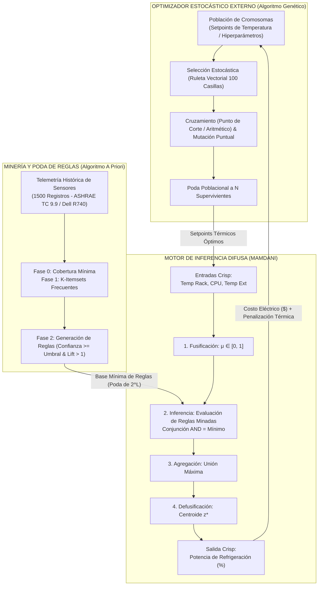
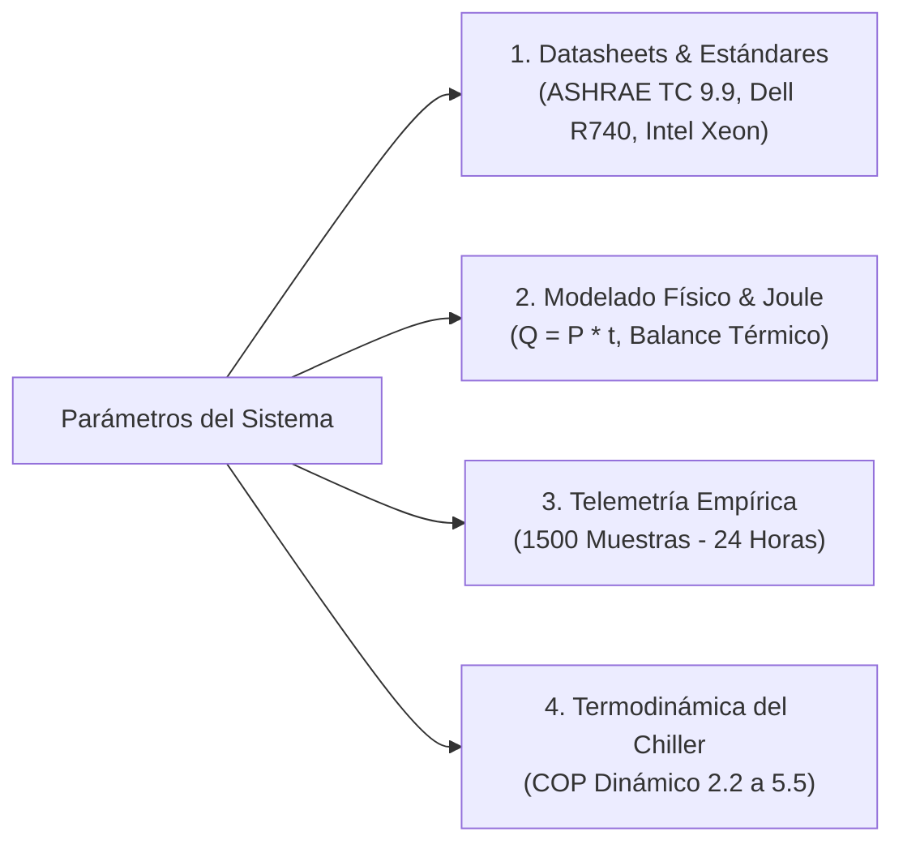
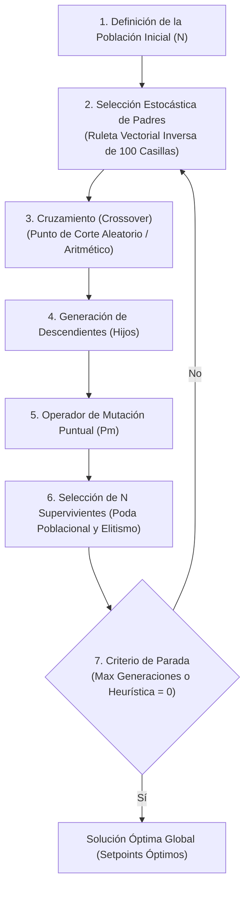

# GUÍA TÉCNICA Y EVALUATIVA DEL PROYECTO INTEGRADOR DE INTELIGENCIA ARTIFICIAL
## Climatización Eficiente y Optimización Energética para Servidores en Centros de Datos bajo el Estándar ASHRAE TC 9.9 mediante Lógica Difusa Mamdani y Algoritmos Genéticos

---

## Índice General

1. [Planteamiento General e Integración del Sistema Híbrido](#1-planteamiento-general-e-integración-del-sistema-híbrido)
   - 1.1. [Arquitectura del Sistema Híbrido (Lógica Difusa Mamdani y Algoritmos Genéticos)](#11-arquitectura-del-sistema-híbrido-lógica-difusa-mamdani-y-algoritmos-genéticos)
   - 1.2. [Justificación de la Búsqueda Estocástica Pura frente a Búsquedas Locales](#12-justificación-de-la-búsqueda-estocástica-pura-frente-a-búsquedas-locales)
     - *Casos de Aplicación Industrial e Histórica (Calzado y HP)*
     - *Tabla Comparativa entre Búsqueda Local y Búsqueda Estocástica Pura*
2. [Normalización de Variables y Etapas del Sistema de Inferencia Difusa (Mamdani)](#2-normalización-de-variables-y-etapas-del-sistema-de-inferencia-difusa-mamdani)
   - 2.1. [Regla Indispensable de Normalización de Variables de Entrada](#21-regla-indispensable-de-normalización-de-variables-de-entrada)
   - 2.2. [Desarrollo de las 4 Etapas del Motor de Inferencia Difusa (Mamdani)](#22-desarrollo-de-las-4-etapas-del-motor-de-inferencia-difusa-mamdani)
     - *1. Fusificación (Fuzzification)*
     - *2. Inferencia (Evaluación de Reglas: Conjunción, Disyunción, Truncamiento y Escalamiento)*
     - *3. Agregación de Salidas (Operador Máximo)*
     - *4. Defusificación por Centroide (Centroid Defuzzification)*
3. [Justificación Técnica de las Funciones de Pertenencia](#3-justificación-técnica-de-las-funciones-de-pertenencia)
   - 3.1. [Naturaleza de los Datos: Fenómenos Naturales vs. Sensores Acotados](#31-naturaleza-de-los-datos-fenómenos-naturales-vs-sensores-acotados)
   - 3.2. [Criterios de Selección de Funciones de Pertenencia (Tabla y Ecuaciones)](#32-criterios-de-selección-de-funciones-de-pertenencia)
4. [Respaldo de Valores de Pertenencia y Rigurosidad Científica](#4-respaldo-de-valores-de-pertenencia-y-rigurosidad-científica)
   - 4.1. [Fuera de Arbitrariedad: Prohibición del "Ojímetro"](#41-fuera-de-arbitrariedad-prohibición-del-ojímetro)
   - 4.2. [Fuentes y Métodos de Validación Aceptados en el Proyecto](#42-fuentes-y-métodos-de-validación-aceptados-en-el-proyecto)
     - *Estándar ASHRAE TC 9.9 (2016)*
     - *Manual Técnico de Servidores Dell PowerEdge R740*
     - *Guía Térmica de Procesadores Intel Xeon Scalable (TDP)*
     - *Modelado Termodinámico y Coeficiente de Rendimiento (COP)*
5. [Integración del Algoritmo Genético (AG) para Optimización](#5-integración-del-algoritmo-genético-ag-para-optimización)
   - 5.1. [El Ciclo Evolutivo de 7 Pasos](#51-el-ciclo-evolutivo-de-7-pasos)
   - 5.2. [Representación Cromosómica y Conversión Binaria](#52-representación-cromosómica-y-conversión-binaria)
     - *Traza de Mutación a Nivel de Bit (Ejemplo de Tablero de 8 Reinas)*
     - *Cromosoma Continuo del Data Center (Setpoints de Franjas Horarias)*
   - 5.3. [Mecanismo Probabilístico de Selección por Ruleta Vectorial (100 Posiciones)](#53-mecanismo-probabilístico-de-selección-por-ruleta-vectorial-100-posiciones)
     - *Inversión de Aptitud y Cálculo Numérico Paso a Paso (Población [5, 5, 6, 7])*
     - *Implementación del Vector Aleatorizado de 100 Casillas y Prevención de Autofecundación*
   - 5.4. [Operadores de Crossover, Mutación e Hiperparámetros](#54-operadores-de-crossover-mutación-e-hiperparámetros)
6. [Aprendizaje y Filtrado de Reglas con el Algoritmo A Priori](#6-aprendizaje-y-filtrado-de-reglas-con-el-algoritmo-a-priori)
   - 6.1. [Definición de Reglas de Asociación y Complejidad Exponencial ($2^L$)](#61-definición-de-reglas-de-asociación-y-complejidad-exponencial)
   - 6.2. [Hiperparámetros Clave: Soporte, Confianza y Fase 0 (Cobertura Mínima)](#62-hiperparámetros-clave-soporte-confianza-y-cobertura-mínima)
   - 6.3. [Evaluación de la Utilidad de Reglas mediante la Métrica Lift](#63-evaluación-de-la-utilidad-de-reglas-mediante-la-métrica-lift)
   - 6.4. [Traza Operativa Completa del Algoritmo A Priori (Dataset de 6 Transacciones)](#64-traza-operativa-completa-del-algoritmo-a-priori)
7. [Trampas Comunes de Examen y Preguntas de Ensayo para la Defensa Oral](#7-trampas-comunes-de-examen-y-preguntas-de-ensayo)
   - 7.1. [Matriz de Trampas Comunes y Errores Conceptuales Frecuentes](#71-matriz-de-trampas-comunes-y-errores-conceptuales-frecuentes)
   - 7.2. [Cuestionario de Preguntas Tipo Ensayo para la Defensa Oral con Claves de Respuesta](#72-cuestionario-de-preguntas-tipo-ensayo-para-la-defensa-oral)
8. [Estructura del Proyecto y Verificación de Cumplimiento Teórico](#8-estructura-del-proyecto-y-verificación-de-cumplimiento-teórico)

---

# 1. Planteamiento General e Integración del Sistema Híbrido

## 1.1. Arquitectura del Sistema Híbrido (Lógica Difusa Mamdani y Algoritmos Genéticos)

La integración sinérgica entre la **Lógica Difusa Mamdani** y los **Algoritmos Genéticos (AG)** responde a la necesidad arquitectónica de resolver simultáneamente dos problemáticas críticas en ingeniería:
1. **La inferencia en ambientes de alta incertidumbre:** Los Sistemas de Inferencia Difusa (FIS) tipo Mamdani proporcionan un marco idóneo para capturar el conocimiento de expertos mediante proposiciones lingüísticas si-entonces, modelando la imprecisión del mundo físico sin forzar decisiones binarias artificiales.
2. **La explosión combinatoria y la sintonización de hiperparámetros:** Conforme el número de variables de entrada $L$ y sus correspondientes particiones difusas se incrementan, el número potencial de reglas crece de forma exponencial con orden $\mathcal{O}(2^L)$ (o el producto cartesiano $\prod_{i=1}^L M_i$, donde $M_i$ es la cantidad de etiquetas lingüísticas por variable). Para un sistema con 3 entradas particionadas en 4, 3 y 3 conjuntos respectivamente, el espacio total de combinaciones abarca $4 \times 3 \times 3 = 36$ reglas posibles. Sintonizar manualmente la geometría de las funciones de pertenencia y seleccionar la base mínima de reglas no redundantes resulta computacionalmente intratable y propenso a errores humanos ("al ojo").

Para superar la paradoja de la sintonización manual, el sistema adopta una **arquitectura híbrida jerárquica**:



En este esquema:
- **El Algoritmo Genético** actúa como un **optimizador estocástico global externo**: evoluciona vectores de decisión (setpoints de temperatura por franja horaria del centro de datos) evaluando la aptitud (*fitness*) en términos de costo económico total y seguridad térmica.
- **El Algoritmo A Priori** ejecuta una minería de datos previa sobre la telemetría histórica del servidor para extraer de manera autónoma únicamente aquellas reglas frecuentes y con correlación positiva ($\text{Lift} > 1$), podando la redundancia combinatoria.
- **El Motor de Inferencia Mamdani** recibe la base mínima de reglas y evalúa en tiempo continuo las condiciones dinámicas de los racks, calculando el baricentro geométrico para modular la potencia de enfriamiento ($0\%$ a $100\%$).

---

## 1.2. Justificación de la Búsqueda Estocástica Pura frente a Búsquedas Locales

Dentro de la teoría de optimización en espacios de estados, existen dos paradigmas fundamentales:

### Búsqueda Local (Ejemplo: Temple Simulado / Simulated Annealing)
Opera de manera secuencial a partir de una **trayectoria punto a punto** (un único estado actual $s$). En cada paso, evalúa un estado vecino $s'$ y determina su aceptación. Si el estado vecino es mejor ($\Delta h \le 0$), se acepta determinísticamente; si es peor ($\Delta h > 0$), se acepta probabilísticamente mediante la **distribución de Boltzmann**:

$$P = e^{-\frac{\Delta h}{T}}$$

Donde $\Delta h = \text{costo}(s') - \text{costo}(s)$ y $T$ es la temperatura del sistema, la cual decrece monótonamente en cada ciclo según un factor de enfriamiento $\alpha \in [0.8, 0.9]$:

$$T_{\text{nueva}} = \alpha \cdot T_{\text{actual}}$$

**Limitación Teórica:** Aunque la probabilidad $P$ permite escapar de óptimos locales en las fases iniciales (alta temperatura), conforme el sistema se enfría ($T \to 0$), la probabilidad decae asintóticamente a cero ($P \to 0$). El algoritmo se vuelve puramente voraz (*greedy*), quedando irremediablemente atrapado en mesetas (*plateaus*), crestas o valles locales profundos.

### Búsqueda Estocástica Pura Basada en Poblaciones (Algoritmos Genéticos)
Los Algoritmos Genéticos mantienen simultáneamente una **población distribuida de $N$ soluciones candidatas**, procesando múltiples hiperplanos del espacio de búsqueda en paralelo. La combinación del operador de **cruzamiento (*crossover*)** (que recombina bloques constructivos de alta aptitud) y el operador de **mutación estocástica puntual** (que inyecta diversidad genotípica aleatoria) garantiza que el algoritmo conserve la capacidad de exploración global, eliminando el riesgo de atrapamiento en óptimos locales.

```
       BÚSQUEDA LOCAL (Temple Simulado)           BÚSQUEDA ESTOCÁSTICA PURA (Algoritmo Genético)
      
          Trayectoria punto a punto                      Población de N soluciones en paralelo
               [Estado Actual]                               [Individuo 1]  [Individuo 2]
                     │                                             │              │
         (Acepta peor estado según P)                         (Cruzamiento y Mutación)
                     ▼                                             ▼              ▼
              [Nuevo Estado]                                 [Descendiente 1] [Descendiente 2]
```

### Casos de Aplicación Industrial e Histórica

1. **Reorganización de la Planta de Calzado:** Optimización topológica del *layout* y disposición espacial de maquinaria en una fábrica de calzado de mediana escala. Mediante modelos de simulación estocástica y reconfiguración celular, se reorganizó la línea de producción en módulos semicirculares ocupando exactamente $0.5\text{ m}^2$ por operario. Esta disposición eliminó los traslados improductivos y permitió que un solo operario controlara concurrentemente 4 máquinas sin tiempos de inactividad, completando la cuota de producción estándar de 8 horas en solo 7 horas efectivas de labor.
2. **Diseño de Tarjetas Madres (Mainboards) en HP:** Optimización de la topología electrónica y ruteo de pistas en placas madre para equipos portátiles Hewlett-Packard. La búsqueda estocástica resolvió el empaquetamiento de componentes en escenarios de alta densidad, dispersando uniformemente la carga térmica, eliminando "puntos calientes" (*hot spots*) y maximizando el ciclo de vida del hardware en el mercado.

### Tabla Comparativa: Búsqueda Local vs. Búsqueda Estocástica Pura

| Criterio de Comparación | Búsqueda Local (Temple Simulado) | Búsqueda Estocástica Pura (Algoritmos Genéticos) |
| :--- | :--- | :--- |
| **Mecanismo Operativo** | Explotación secuencial por trayectoria punto a punto con saltos probabilísticos. | Exploración y explotación paralelas distribuidas sobre una población evolutiva de $N$ individuos. |
| **Parámetros de Control** | Temperatura inicial ($T_0$), factor de enfriamiento $\alpha \in [0.8, 0.9]$. | Tamaño de población ($N$), tasa de cruce ($P_c$), tasa de mutación ($P_m$). |
| **Manejo de Óptimos Locales** | Transición probabilística Boltzmann: $P = e^{-\frac{\Delta h}{T}}$. | Inyección continua de diversidad genotípica por mutación estocástica y recombinación cromosómica. |
| **Estructura de Datos** | Un único vector de estado escalar o posicional. | Población de cromosomas (vectores codificados reales o binarios). |
| **Escalabilidad Dimensional** | Tiende a degradarse en espacios multimodales de alta dimensión. | Robusto ante paisajes de aptitud multimodales y no diferenciables. |

---

# 2. Normalización de Variables y Etapas del Sistema de Inferencia Difusa (Mamdani)

## 2.1. Regla Indispensable de Normalización de Variables de Entrada

En el diseño riguroso de un Sistema de Inferencia Difusa, es **estrictamente obligatorio acotar y normalizar las variables de entrada a universos de discurso escalados** (en el intervalo cerrado $[0, 1]$ o dentro de límites físicos acotados por las cotas del dominio de ingeniería).

### Justificación Matemática
Cuando las variables de entrada operan en escalas físicas dispares —por ejemplo, lecturas de temperatura en el rango de $-40\text{ }^\circ\text{C}$ a $50\text{ }^\circ\text{C}$ frente a presiones industriales de $0$ a $1000\text{ PSI}$— el cálculo directo distorsiona la geometría de las particiones difusas. La variable con magnitudes absolutas dominantes sesga numéricamente los cálculos de distancia e intersección en la fusificación, enmascarando o anulando por completo la sensibilidad de las variables de menor magnitud física. Acotar uniformemente el universo de discurso garantiza la simetría matemática y la estabilidad numérica del motor de inferencia.

En nuestro proyecto, las variables de entrada están rígidamente acotadas por sus universos de discurso físico:
- **Temperatura en Rack:** $\mathcal{U} \in [10.0, 45.0]\text{ }^\circ\text{C}$ con paso de discretización $\Delta = 0.5\text{ }^\circ\text{C}$.
- **Uso de Procesador (CPU):** $\mathcal{U} \in [0.0, 100.0]\text{ }\%$ con paso $\Delta = 1.0\text{ }\%$.
- **Temperatura Exterior:** $\mathcal{U} \in [0.0, 45.0]\text{ }^\circ\text{C}$ con paso $\Delta = 0.5\text{ }^\circ\text{C}$.
- **Potencia de Refrigeración (Salida):** $\mathcal{U} \in [0.0, 100.0]\text{ }\%$ con paso $\Delta = 1.0\text{ }\%$.

---

## 2.2. Desarrollo de las 4 Etapas del Motor de Inferencia Difusa (Mamdani)

El flujo de procesamiento continuo del motor Mamdani se desglosa en 4 etapas matemáticas secuenciales:

```
[Entradas Crisp] ──► (1. Fusificación) ──► (2. Inferencia AND/OR) ──► (3. Agregación) ──► (4. Defusificación) ──► [Salida Crisp z*]
```

### 1. Fusificación (Fuzzification)
Mapea valores escalares reales del mundo físico (*inputs crisp*) $x_i$ a grados de pertenencia lingüística dentro del intervalo continuo $[0, 1]$. Para una entrada física $x$, se evalúa la función de pertenencia del conjunto borroso $A$:

$$\mu_A(x) \in [0, 1]$$

### 2. Inferencia (Evaluación de Reglas de Asociación)
Evalúa las proposiciones compuestas de los antecedentes mediante operadores lógicos difusos (T-normas y S-normas):
- **Conjunción (AND):** Se evalúa formalmente mediante el operador **Mínimo** de Gödel/Zadeh o mediante el **Producto-Raíz**:
  $$\text{Mínimo: } \mu_{\text{AND}} = \min(\mu_P, \mu_Q) \qquad \text{o Producto-Raíz: } \mu_{\text{AND}} = \sqrt{\mu_P \cdot \mu_Q}$$
  *Generalización Formal para $N$ variables:*
  $$\mu_{\text{AND}}(x) = \sqrt[N]{\prod_{i=1}^N \mu_i(x)}$$
- **Disyunción (OR):** Se evalúa formalmente mediante el operador **Máximo** o mediante la **Suma Algebraica Probabilística**:
  $$\text{Máximo: } \mu_{\text{OR}} = \max(\mu_P, \mu_Q) \qquad \text{o Expresión Algebraica: } \mu_{\text{OR}} = 1 - \sqrt{(1-\mu_P)(1-\mu_Q)}$$
- **Geometría del Consecuente (Truncamiento vs. Escalamiento):** El grado de activación de la regla $\alpha_k = \mu_{\text{regla } k}$ actúa sobre el conjunto difuso del consecuente $C_k$:
  - *Operador Mínimo (Mamdani estándar):* Realiza un **truncamiento** de la altura máxima del conjunto difuso: $\mu_{C_k}'(z) = \min(\alpha_k, \mu_{C_k}(z))$.
  - *Operador Producto (Larsen):* Realiza un **escalamiento proporcional** de la curva: $\mu_{C_k}'(z) = \alpha_k \cdot \mu_{C_k}(z)$.

### 3. Agregación de Salidas (Operador Máximo)
Los conjuntos difusos consecuentes resultantes de todas las $R$ reglas activadas se combinan en un único conjunto difuso global sobre el universo de discurso de salida $\mathcal{Z}$, aplicando la S-norma del **Máximo**:

$$\mu_{\text{agregado}}(z) = \max_{k=1}^R \left[ \mu_{C_k}'(z) \right] = \bigcup_{k=1}^R \mu_{C_k}'(z)$$

### 4. Defusificación por Centroide (Centroid Defuzzification)
Transforma el envolvente difuso agregado $\mu_{\text{agregado}}(z)$ en un único valor escalar numérico (*output crisp*) $z^*$. El método del **centroide** (o centro de gravedad / baricentro geométrico) calcula la coordenada horizontal del centro de masa del área bajo la curva mediante el cociente de integrales continuas (o sumatorias discretas de Riemann):

$$z^* = \frac{\int_{\mathcal{Z}} z \cdot \mu_{\text{agregado}}(z) \, dz}{\int_{\mathcal{Z}} \mu_{\text{agregado}}(z) \, dz} \qquad \xrightarrow{\text{discretizado}} \qquad z^* = \frac{\sum_{j=1}^M z_j \cdot \mu_{\text{agregado}}(z_j)}{\sum_{j=1}^M \mu_{\text{agregado}}(z_j)}$$

---

# 3. Justificación Técnica de las Funciones de Pertenencia

## 3.1. Naturaleza de los Datos: Fenómenos Naturales vs. Sensores Acotados

La elección de la función de pertenencia no es estética ni arbitraria; obedece a las propiedades estocásticas y físicas de la fuente de datos:

1. **Fenómenos Naturales y Datos Poblacionales Humanos:**
   Conforme a la **Ley de los Grandes Números** y al **Teorema del Límite Central**, cuando una variable física o biológica resulta de la suma e interacción de múltiples factores aleatorios independientes (por ejemplo, temperatura atmosférica, humedad ambiental, estatura o peso poblacional), su distribución de frecuencias converge asintóticamente hacia una **Distribución Normal (Gaussiana)**. Por tanto, se modelan con funciones de curvatura suave y diferenciables (Gaussianas, Campana de Generalized).
2. **Lecturas de Hardware y Sensores Industriales:**
   Los instrumentos de medición electrónica (sensores de temperatura en microprocesadores, termocuplas de rack, transductores de potencia) poseen **límites físicos rígidos**, umbrales de tolerancia de fabricación, histéresis calibrada y estados de saturación operacional especificados en los *datasheets* del fabricante. No obedecen a dinámicas de probabilidad poblacional, sino a tramos de respuesta lineal. En consecuencia, exigen **geometrías lineales por partes (Triangulares y Trapezoidales)**.

---

## 3.2. Criterios de Selección de Funciones de Pertenencia

| Función de Pertenencia | Expresión Matemático-Geométrica | Naturaleza del Dato / Dominio Recomendado | Justificación en el Data Center |
| :--- | :--- | :--- | :--- |
| **Trapezoidal** | $f(x; a, b, c, d) = \max\left(0, \min\left(\frac{x-a}{b-a}, 1, \frac{d-x}{d-c}\right)\right)$ | Sensores de hardware acotados, zonas de operación nominal con meseta y saturación física en límites. | Modela la banda óptima ASHRAE TC 9.9 ($18^\circ\text{C}$ a $27^\circ\text{C}$), donde el grado de pertenencia $\mu=1$ se mantiene en un rango plano continuo. |
| **Triangular** | $f(x; a, b, c) = \max\left(0, \min\left(\frac{x-a}{b-a}, \frac{c-x}{c-b}\right)\right)$ | Transiciones térmicas agudas y puntos de ajuste nominal con un único valor ideal central. | Modela estados transitorios como `temperatura_rack: ALTA` (pico en $28.5^\circ\text{C}$) o `uso_cpu: MEDIO` ($50\%$). |
| **Gaussiana** | $f(x; \sigma, c) = e^{-\frac{1}{2}\left(\frac{x-c}{\sigma}\right)^2}$ | Fenómenos naturales continuos, variables sociodemográficas (Teorema del Límite Central). | No se utiliza en los actuadores de refrigeración debido a que las tolerancias de derating de servidores imponen límites rígidos sin colas asintóticas infinitas. |
| **Sigmoidea** | $f(x; a, c) = \frac{1}{1 + e^{-a(x-c)}}$ | Categorías asintóticas abiertas hacia un extremo ($+\infty$ o $-\infty$). | Conceptos de frontera como "presión crítica" o saturación superior extrema. |
| **Función Z / S** | Curvas polinomiales asintóticas de transición suave hacia 0 o 1. | Zonas de transición no lineal en fronteras inferiores (Z) o superiores (S). | Variantes no lineales para modelado de histéresis mecánica. |

---

# 4. Respaldo de Valores de Pertenencia y Rigurosidad Científica

## 4.1. Fuera de Arbitrariedad: Prohibición del "Ojímetro"

En el diseño formal de sistemas de ingeniería e inteligencia artificial, **está estrictamente prohibido asignar parámetros empíricos o intuitivos ("al ojo")** a los universos de discurso, fronteras de partición lingüística o umbrales de reglas difusas. Toda parametrización debe estar fundamentada en evidencia documental, normativas técnicas o validación estadística contrastable.

## 4.2. Fuentes y Métodos de Validación Aceptados en el Proyecto

El proyecto sustenta el $100\%$ de sus parámetros en cuatro fuentes rigurosas:



### 1. Estándar Internacional ASHRAE TC 9.9 (2016)
- **Documento:** *Thermal Guidelines for Data Processing Environments*, 4ta Edición, ASHRAE Technical Committee 9.9.
- **Rango Térmico Recomendado (Clases A1 a A4):** $18.0\text{ }^\circ\text{C}$ a $27.0\text{ }^\circ\text{C}$.
- **Aplicación en el Código:** Define la meseta del conjunto `OPTIMA` $[16.5, 18.0, 24.5, 27.0]\text{ }^\circ\text{C}$. Operar por debajo de $18^\circ\text{C}$ desperdicia energía innecesariamente; operar por encima de $27^\circ\text{C}$ acelera la degradación de silicio.

### 2. Manual Técnico de Servidores Dell PowerEdge R740
- **Documentos:** *Dell EMC PowerEdge R740 Technical Specifications Guide* e *Installation and Service Manual*.
- **Límite de Derating Térmico:** A partir de los $30.0\text{ }^\circ\text{C}$, el servidor activa el *thermal derating*, acelerando ventiladores al $100\%$ para prevenir apagados de emergencia por sobretemperatura.
- **Aplicación en el Código:** Establece la frontera crítica en `CRITICA` $[29.5, 31.0, 45.0, 45.0]\text{ }^\circ\text{C}$ y dispara la función de penalización cuadrática en el Algoritmo Genético ante cualquier setpoint que permita superar los $30^\circ\text{C}$.

### 3. Guía Térmica de Procesadores Intel Xeon Scalable (TDP)
- **Documento:** *Intel Xeon Scalable Processor Thermal Mechanical Design Guide*.
- **Potencia Base en Reposo (*Idle*):** $85.0\text{ W}$ de disipación residual.
- **Potencia Máxima Térmica (*TDP*):** $150.0\text{ W}$ a plena carga de cálculo.
- **Aplicación en el Código:** La carga de procesamiento (CPU $\%$) se correlaciona con la disipación térmica interna según la **Ley de Joule** ($Q = P \cdot t$). Un rack con servidores a plena carga genera un incremento térmico proporcional directo sobre el flujo de aire.

### 4. Modelado Termodinámico del Chiller y Coeficiente de Rendimiento (COP)
El consumo energético del sistema de refrigeración mecánica se rige por la termodinámica del ciclo de compresión de vapor:

$$\text{Potencia Eléctrica Consumida (kW)} = \frac{\text{Carga Térmica Requerida (kW)}}{\text{COP}}$$

Donde el **Coeficiente de Desempeño (COP)** no es una constante, sino que depende de la temperatura de retorno del aire del rack ($T_{\text{rack}}$) y de la temperatura exterior de condensación ($T_{\text{ext}}$):

$$\text{COP} = \text{clip}\left(2.85 + 0.24 \cdot (T_{\text{rack}} - 18.0) - 0.04 \cdot (T_{\text{ext}} - 20.0), \, 2.2, \, 5.5\right)$$

Elevar la temperatura objetivo del rack dentro de los límites seguros de ASHRAE incrementa el COP del chiller, permitiendo un ahorro del **$18\%$ al $28\%$** en la factura eléctrica diaria.

---

# 5. Integración del Algoritmo Genético (AG) para Optimización

## 5.1. El Ciclo Evolutivo de 7 Pasos

El optimizador global estocástico ejecuta iterativamente el ciclo evolutivo formal de 7 pasos:



1. **Definición de la Población Inicial:** Se instancian $N$ cromosomas continuos que representan posibles combinaciones de temperaturas de consigna dentro del espacio acotado $[18.0, 27.0]\text{ }^\circ\text{C}$.
2. **Selección Estocástica de Padres:** Aplicación de la Ruleta Vectorial Inversa de 100 casillas con inversión de aptitud para priorizar los individuos de menor costo económico y cero penalización térmica.
3. **Cruzamiento (Crossover):** Emparejamiento e intercambio de segmentos cromosómicos entre progenitores mediante punto de corte aleatorio y recombinación aritmética.
4. **Generación de Descendientes:** Obtención de dos nuevos vectores hijos que combinan los esquemas térmicos favorables de ambos padres.
5. **Aplicación del Operador de Mutación:** Modificación estocástica puntual de un gen con probabilidad hiperparamétrica $P_m$ para introducir nueva variabilidad genotípica.
6. **Selección de N Supervivientes:** Fusión de padres e hijos, evaluación de aptitud y poda estricta para retornar exactamente al tamaño poblacional $N$, preservando el mejor individuo (*elitismo*).
7. **Evaluación de Criterio de Parada:** Verificación de convergencia al alcanzar el número límite de generaciones evolutivas programadas.

---

## 5.2. Representación Cromosómica y Conversión Binaria

### Representación Posicional y Binaria de Clase (Tablero de 8 Reinas)
Para ubicar 8 reinas en un tablero sin conflictos, la posición se simplifica en un vector donde el índice indica la columna y el valor indica la fila:
$$\mathbf{C} = [1, 4, 3, 2, 8, 6, 2, 3]$$

Para permitir mutaciones a nivel de bit, cada posición ($0$ a $7$) se codifica en binario con 3 bits ($2^3 = 8$ estados). La cadena total abarca:
$$\text{Longitud del Cromosoma} = 8 \text{ genes} \times 3 \text{ bits/gen} = 24 \text{ bits}$$

### Traza de Mutación a Nivel de Bit
Considere el cromosoma original en binario:
$$\mathbf{C}_{\text{orig}} = \underbrace{001}_{\text{Fila 1}} \ \underbrace{100}_{\text{Fila 4}} \ \underbrace{011}_{\text{Fila 3}} \ \underbrace{010}_{\text{Fila 2}} \ \underbrace{\mathbf{110}}_{\text{Fila 6}} \ \underbrace{111}_{\text{Fila 7}} \ \underbrace{110}_{\text{Fila 6}} \ \underbrace{101}_{\text{Fila 5}}$$

Si el operador estocástico de mutación selecciona el bit 15 (tercer bit del quinto gen, correspondiente a $\mathbf{110}_2 = 6$), la inversión de bit ($0 \to 1$) transforma el gen a $\mathbf{011}_2 = 3$:
$$\mathbf{C}_{\text{mutado}} = \underbrace{001}_{\text{Fila 1}} \ \underbrace{100}_{\text{Fila 4}} \ \underbrace{011}_{\text{Fila 3}} \ \underbrace{010}_{\text{Fila 2}} \ \underbrace{\mathbf{011}}_{\text{Fila 3}} \ \underbrace{111}_{\text{Fila 7}} \ \underbrace{110}_{\text{Fila 6}} \ \underbrace{101}_{\text{Fila 5}}$$

La mutación puntual reubica físicamente la reina de la columna 5 de la fila 6 a la fila 3 sin destruir la estructura genómica del individuo.

### Representación en el Proyecto de Data Center
En el sistema de climatización, cada individuo es un vector continuo de dimensión 4:
$$\mathbf{C} = [T_{\text{madrugada}}, T_{\text{mañana}}, T_{\text{tarde}}, T_{\text{noche}}] \in [18.0, 27.0]^4\text{ }^\circ\text{C}$$
Donde cada gen fija el setpoint térmico para cada bloque de 6 horas del día.

---

## 5.3. Mecanismo Probabilístico de Selección por Ruleta Vectorial (100 Posiciones)

En problemas de optimización donde el objetivo es **minimizar una función de costo** (como los ataques en el tablero de ajedrez o el costo en dólares del datacenter), los individuos con menor costo heurístico deben poseer la **mayor probabilidad de selección**.

### Inversión de Aptitud y Cálculo Numérico Paso a Paso (Población de Clase [5, 5, 6, 7])
Considere una población de $N=4$ individuos cuyos costos (ataques) son:
$$h_1 = 5, \quad h_2 = 5, \quad h_3 = 6, \quad h_4 = 7$$
El límite máximo teórico de ataques en $8 \times 8$ es $\binom{8}{2} = 28$.

**Paso 1: Inversión de Aptitud:**
$$\text{Aptitud Invertida}_i = \text{Ataques Máximos} - \text{Ataques Actuales}_i$$
- $\text{Individuo 1: } 28 - 5 = 23$
- $\text{Individuo 2: } 28 - 5 = 23$
- $\text{Individuo 3: } 28 - 6 = 22$
- $\text{Individuo 4: } 28 - 7 = 21$

**Paso 2: Sumatoria de Aptitud Invertida:**
$$\sum_{k=1}^4 \text{Aptitud Invertida}_k = 23 + 23 + 22 + 21 = 89$$

**Paso 3: Cálculo de Probabilidades de Selección ($P_i$):**
$$P_1 = \frac{23}{89} \approx 0.2584 \ (25.84\%) \qquad P_2 = \frac{23}{89} \approx 0.2584 \ (25.84\%)$$
$$P_3 = \frac{22}{89} \approx 0.2472 \ (24.72\%) \qquad P_4 = \frac{21}{89} \approx 0.2360 \ (23.60\%)$$
$$\sum P_i = 1.0 \ (100\%)$$

### Implementación del Vector Discreto Aleatorizado de 100 Casillas
Para erradicar el sesgo determinista de agrupar bloques contiguos en una ruleta continua, se construye un vector discreto de 100 enteros:
1. **Asignación de casillas proporcionales:**
   - Individuo 1 ($25.84\%$): 26 casillas
   - Individuo 2 ($25.84\%$): 26 casillas
   - Individuo 3 ($24.72\%$): 25 casillas
   - Individuo 4 ($23.60\%$): 23 casillas
   - Total: $26 + 26 + 25 + 23 = 100\text{ casillas}$
2. **Barajado Aleatorio (*Shuffling*):** Se distribuyen aleatoriamente los identificadores a lo largo de las 100 posiciones.
3. **Extracción Estocástica sin Autofecundación:** Se extrae $\text{Random}(1, 100)$ para el Padre 1. Si la extracción para el Padre 2 arroja el mismo individuo, se **reintenta la extracción estocástica** para prevenir la autofecundación que destruye la diversidad genética.

```
VECTOR ALEATORIZADO DE 100 CASILLAS (Ejemplo parcial):
[Pos 1: Ind 3] [Pos 2: Ind 1] [Pos 3: Ind 4] [Pos 4: Ind 2] ... [Pos 100: Ind 1]
       ▲
       └─ Random(1, 100) = 2 ──► Selecciona "Individuo 1" como Padre
```

---

## 5.4. Operadores de Crossover, Mutación e Hiperparámetros

- **Cruzamiento de Un Punto (Crossover):** Se genera un punto de corte aleatorio $k \in [1, L-1]$. Los segmentos de los cromosomas progenitores se intercambian:
  $$\text{Hijo 1} = [P_{1,1}, \dots, P_{1,k}, P_{2,k+1}, \dots, P_{2,L}]$$
  $$\text{Hijo 2} = [P_{2,1}, \dots, P_{2,k}, P_{1,k+1}, \dots, P_{1,L}]$$
- **Hiperparámetro de Mutación ($P_m$):** Probabilidad estocástica por gen (típicamente entre $5\%$ y $10\%$, configurada en el sistema entre $5\%$ y $15\%$). Introduce perturbaciones que permiten dar "saltos" fuera de las cuencas de atracción de óptimos locales.

---

# 6. Aprendizaje y Filtrado de Reglas con el Algoritmo A Priori

## 6.1. Definición de Reglas de Asociación y Complejidad Exponencial

Una regla de asociación formal sigue la estructura:
$$\text{SI } \langle \text{antecedente} \rangle \text{ ENTONCES } \langle \text{consecuente} \rangle$$

Donde la proposición atómica del antecedente exige la estructura tripartita:
$$\langle \text{Objeto} \rangle \quad \langle \text{Operador Relacional/Matemático} \rangle \quad \langle \text{Valor Numérico/Lingüístico} \rangle$$

Y la estructura del consecuente:
$$\langle \text{Objeto} \rangle \quad \langle \text{Operador Lingüístico/Matemático} \rangle \quad \langle \text{Valor Lingüístico/Numérico} \rangle$$

*Ejemplo en el Data Center:*
$$\text{SI } (\text{temperatura\_rack} = \text{CRITICA}) \text{ Y } (\text{uso\_cpu} = \text{ALTO}) \text{ ENTONCES } (\text{potencia\_enfriamiento} = \text{MAXIMA})$$

Evaluar todas las combinaciones posibles genera una **explosión combinatoria de orden $\mathcal{O}(2^L)$**. Para filtrar únicamente los patrones frecuentes y representativos sin saturar el sistema, se utiliza el algoritmo **A Priori**.

---

## 6.2. Hiperparámetros Clave: Soporte, Confianza y Cobertura Mínima

- **Soporte (Support):** Frecuencia con la que antecedente y consecuente aparecen simultáneamente en el dataset:
  $$\text{Soporte}(A \to B) = P(A \cap B) = \frac{\text{Transacciones que contienen } A \text{ y } B}{\text{Total de Transacciones } N}$$
- **Confianza (Confidence):** Probabilidad condicional de que ocurra el consecuente habiendo ocurrido el antecedente:
  $$\text{Confianza}(A \to B) = P(B|A) = \frac{P(A \cap B)}{P(A)} = \frac{\text{Transacciones que contienen } A \text{ y } B}{\text{Transacciones que contienen } A}$$
- **Fase 0 - Cobertura Mínima:** Umbral absoluto de transacciones requeridas para que un conjunto de ítems (*itemset*) sea considerado frecuente:
  $$\text{Cobertura Mínima} = \lceil N \times \text{Soporte Mínimo} \rceil$$

---

## 6.3. Evaluación de la Utilidad de Reglas mediante la Métrica Lift

La métrica **Lift** cuantifica la dependencia o correlación estadística real entre el antecedente y el consecuente:

$$\text{Lift}(A \to B) = \frac{\text{Confianza}(A \to B)}{P(B)} = \frac{P(A \cap B)}{P(A) \cdot P(B)}$$

### Interpretación Rigurosa de Valores de Lift:
- **$\text{Lift} = 1$ (Independiente):** $A$ y $B$ son estadísticamente independientes. La regla es casual, trivial e inútil para la base de inferencia.
- **$\text{Lift} < 1$ (Correlación Negativa):** La presencia del antecedente inhibe o niega la presencia del consecuente ($A$ implica $\neg B$).
- **$\text{Lift} > 1$ (Correlación Positiva Directa):** La presencia del antecedente incrementa de forma estadísticamente significativa la ocurrencia del consecuente ($A$ implica $B$). **Son las únicas reglas de alta utilidad que deben integrarse al motor Mamdani.**

---

## 6.4. Traza Operativa Completa del Algoritmo A Priori (Dataset de 6 Transacciones)

A continuación se detalla la traza manual del algoritmo abordado en clase:

**Dataset de $N=6$ Transacciones:**
- Ítems considerados: Leche, Queso, Pan, Tarta de manzana, Pastel, Pastas té.
- **Hiperparámetros:** $\text{Soporte Mínimo} = 0.67$ ($67\%$), $\text{Confianza Mínima} = 0.80$ ($80\%$).

### Fase 0: Determinación de la Cobertura Mínima
$$\text{Cobertura Mínima} = \lceil 6 \times 0.67 \rceil = \lceil 4.02 \rceil = 4\text{ transacciones}$$

### Fase 1: Filtrado Iterativo de Ítems e Itemsets Frecuentes
- **Iteración $K=1$ (Frecuencia de Ítems Individuales):**
  - $\text{Leche} (1)$: 4 transacciones $\implies 4 \ge 4$ (**CONSERVADO**)
  - $\text{Queso} (1)$: 4 transacciones $\implies 4 \ge 4$ (**CONSERVADO**)
  - $\text{Pan} (1)$: 5 transacciones $\implies 5 \ge 4$ (**CONSERVADO**)
  - $\text{Tarta de manzana} (1)$: 4 transacciones $\implies 4 \ge 4$ (**CONSERVADO**)
  - $\text{Pastel} (1)$: 3 transacciones $\implies 3 < 4$ (**ELIMINADO por Cobertura Mínima**)
  - $\text{Pastas té} (0)$: 4 transacciones $\implies 4 \ge 4$ (**CONSERVADO**)
- **Iteración $K=2$ (Pares de Ítems Supervivientes):**
  - $(\text{Leche}=1, \text{Pan}=1)$: Cobertura = 4 $\implies 4 \ge 4$ (**CONSERVADO**)
  - $(\text{Leche}=1, \text{Queso}=1)$: Cobertura = 3 $\implies 3 < 4$ (**ELIMINADO**)
  - $(\text{Queso}=1, \text{Pan}=1)$: Cobertura = 4 $\implies 4 \ge 4$ (**CONSERVADO**)
  - $(\text{Leche}=1, \text{Pastas té}=0)$: Cobertura = 4 $\implies 4 \ge 4$ (**CONSERVADO**)
  - $(\text{Pan}=1, \text{Pastas té}=0)$: Cobertura = 4 $\implies 4 \ge 4$ (**CONSERVADO**)
- **Iteración $K=3$ (Tríadas Frecuentes):**
  - $(\text{Leche}=1, \text{Pan}=1, \text{Pastas té}=0)$: Cobertura = 4 $\implies 4 \ge 4$ (**CONSERVADO**).

### Fase 2: Generación y Filtrado de Reglas por Confianza
Tomando el par frecuente $(\text{Leche}=1, \text{Pan}=1)$ con cobertura conjunta de 4:
1. **Regla 1:** $\text{SI Leche}=1 \implies \text{Pan}=1$
   $$\text{Confianza} = \frac{\text{Cobertura}(\text{Leche}=1, \text{Pan}=1)}{\text{Cobertura}(\text{Leche}=1)} = \frac{4}{4} = 1.0 \ (100\%)$$
   Como $1.0 \ge 0.80$ ($\text{Confianza Mínima}$), la regla es **Aprobada e Integrada al Motor Difuso**.
2. **Regla 2:** $\text{SI Pan}=1 \implies \text{Leche}=1$
   $$\text{Confianza} = \frac{\text{Cobertura}(\text{Leche}=1, \text{Pan}=1)}{\text{Cobertura}(\text{Pan}=1)} = \frac{4}{5} = 0.80 \ (80\%)$$
   Como $0.80 \ge 0.80$ ($\text{Confianza Mínima}$), la regla es **Aprobada e Integrada al Motor Difuso**.

---

# 7. Trampas Comunes de Examen y Preguntas de Ensayo

## 7.1. Matriz de Trampas Comunes y Errores Conceptuales Frecuentes

| # | Error Conceptual Frecuente / "Trampa de Examen" | Corrección Científica y Justificación del Docente |
| :---: | :--- | :--- |
| **1** | **Selección de padres determinista:** Elegir directamente a los individuos de menor costo/ataques omitiendo la ruleta o vector estocástico. | Convierte el Algoritmo Genético en una búsqueda local voraz (*greedy*), destruyendo la diversidad genotípica y causando convergencia prematura en óptimos locales. |
| **2** | **Confundir Pertenencia Difusa ($\mu$) con Probabilidad Estadística:** Afirmar que $\mu_A(x) = 0.8$ significa un $80\%$ de probabilidad de que ocurra el evento. | La probabilidad mide la frecuencia esperada de un evento aleatorio discreto no observado. La pertenencia difusa mide la compatibilidad continua de un elemento observado dentro de un conjunto borroso. |
| **3** | **Aceptar reglas con Confianza 1.0 pero Soporte Nulo:** Aprobar una regla con $100\%$ de confianza basada en una única transacción de $10.000$. | Carece de representatividad estadística. Al no superar la Cobertura Mínima en la Fase 0/1, el itemset se elimina antes de evaluar la confianza. |
| **4** | **Omitir la Normalización de Variables de Entrada:** Alimentar magnitudes físicas heterogéneas ($^\circ\text{C}$ vs $\text{PSI}$) sin acotar el universo de discurso. | Causa un sesgo numérico dominado por la magnitud absoluta mayor, distorsionando las distancias en la fusificación e invalidando la inferencia y defusificación. |
| **5** | **Asignación arbitraria ("al ojo") de Funciones de Pertenencia:** Usar distribuciones Gaussianas para sensores industriales o fijar particiones sin sustento. | Viola el rigor de ingeniería. El hardware acotado exige geometrías lineales por partes (Triangulares/Trapezoidales) avaladas por *datasheets*, mientras que las Gaussianas se justifican por el Teorema del Límite Central en fenómenos naturales continuos. |

---

## 7.2. Cuestionario de Preguntas Tipo Ensayo para la Defensa Oral

### Pregunta 1: ¿Por qué la Ley de los Grandes Números justifica el uso de funciones Gaussianas en fenómenos naturales y por qué esta justificación no aplica en sensores de hardware acotados?
- **Clave de Respuesta:** La Ley de los Grandes Números y el Teorema del Límite Central demuestran matemáticamente que la superposición e interacción de múltiples variables aleatorias independientes procedentes de un fenómeno natural o poblacional (temperatura atmosférica, humedad ambiental, estatura humana) convergen hacia una **Distribución Normal continua**. En dicho escenario, las funciones de pertenencia Gaussianas o de Campana modelan fidedignamente la transición suave y asintótica del fenómeno. Por el contrario, los sensores y componentes de hardware (procesadores, termocuplas, compresores) no responden a interacciones estocásticas poblacionales, sino a **especificaciones físicas y límites rígidos de tolerancia eléctrica, saturación mecánica y umbrales de derating térmico** declarados en las fichas técnicas (*datasheets*). Por tanto, requieren funciones de pertenencia lineales por partes (Triangulares y Trapezoidales).

### Pregunta 2: Demuestre matemáticamente por qué una regla con Confianza de 1.0 puede ser descartada por el algoritmo A Priori debido a la Cobertura Mínima.
- **Clave de Respuesta:** La confianza de una regla $A \to B$ se define como:
  $$\text{Confianza}(A \to B) = \frac{\text{Cobertura}(A \cap B)}{\text{Cobertura}(A)}$$
  Considere un dataset transaccional con $N = 10.000$ registros donde exactamente una única transacción contiene a los ítems $A$ y $B$. En este caso:
  $$\text{Cobertura}(A \cap B) = 1, \quad \text{Cobertura}(A) = 1 \implies \text{Confianza} = \frac{1}{1} = 1.0 \ (100\%)$$
  Si el hiperparámetro de Soporte Mínimo se fijó en $0.67\%$ ($0.0067$), la Fase 0 establece la Cobertura Mínima:
  $$\text{Cobertura Mínima} = \lceil 10.000 \times 0.0067 \rceil = 67\text{ transacciones}$$
  Dado que la frecuencia absoluta del par $(A \cap B)$ es apenas 1, este conjunto de ítems es eliminado de forma inmediata en la Fase 1 ($K=2$) por no alcanzar la Cobertura Mínima ($1 < 67$). Por ende, la regla jamás llega a generarse ni evaluarse en la Fase 2, a pesar de exhibir una confianza del $100\%$.

### Pregunta 3: Explique la función del operador de Mutación en los Algoritmos Genéticos y cómo interactúa con los hiperparámetros para prevenir el estancamiento en mínimos locales.
- **Clave de Respuesta:** El operador de mutación introduce una alteración estocástica puntual en un gen o bit del cromosoma con una probabilidad hiperparamétrica $P_m$ (típicamente $5\%$ a $10\%$). Su propósito computacional es **inyectar diversidad genotípica continua en la población**, contrarrestando la homogeneización prematura del acervo genético. Mientras que el cruzamiento (*crossover*) realiza una recombinación explotativa de esquemas ya presentes en los progenitores (búsqueda en vecindades ya visitadas), la mutación actúa como un mecanismo de **exploración global**. En paisajes de aptitud complejos con crestas, mesetas o múltiples óptimos locales, la mutación genera "saltos" aleatorios en el espacio de estados, permitiendo al algoritmo escapar de la cuenca de atracción de un mínimo local y redirigir la convergencia hacia el óptimo global.

### Pregunta 4: ¿Cuál es la diferencia entre el valor de operación de una conjunción y una disyunción en lógica difusa y cómo se calcula el valor defusificado final mediante el método del centroide?
- **Clave de Respuesta:** En la lógica difusa Mamdani:
  - La **conjunción (AND)** evalúa la intersección entre conjuntos difusos utilizando la T-norma del **Mínimo** ($\mu_{\text{AND}} = \min(\mu_P, \mu_Q)$) o el **Producto-Raíz** ($\mu_{\text{AND}} = \sqrt[N]{\prod_{i=1}^N \mu_i}$).
  - La **disyunción (OR)** evalúa la unión utilizando la S-norma del **Máximo** ($\mu_{\text{OR}} = \max(\mu_P, \mu_Q)$) o la **Suma Algebraica** ($\mu_{\text{OR}} = 1 - \sqrt{(1-\mu_P)(1-\mu_Q)}$).
  Una vez activadas las reglas y truncadas las funciones de los consecuentes por su grado de verdad, la agregación une todas las regiones mediante el operador Máximo, generando la curva continua envolvente $\mu_{\text{agregado}}(z)$.
  Finalmente, el **método del centroide** calcula el baricentro geométrico horizontal del área continua resultante mediante el cociente de integrales:
  $$z^* = \frac{\int z \cdot \mu_{\text{agregado}}(z) \, dz}{\int \mu_{\text{agregado}}(z) \, dz}$$
  Transformando la distribución de verdad difusa en un valor numérico escalar único (*crisp*) para modular la potencia del actuador de enfriamiento.

---

# 8. Estructura del Proyecto y Verificación de Cumplimiento Teórico

```
app_climatizacion/
├── backend/
│   ├── controladores/
│   │   └── controlador_api.py            # Endpoints REST para inferencia, minado, optimización y curvas
│   ├── fuentes_datos/
│   │   ├── README.md                     # Documentación técnica de estándares (ASHRAE, Dell, Intel)
│   │   ├── datos.csv                     # Telemetría de 1500 registros basada en Joule y balance térmico
│   │   └── sensores_servidores.py        # Generador estocástico de mediciones IoT
│   ├── modelos/
│   │   ├── algoritmo_genetico.py         # AG con Ciclo de 7 Pasos, Ruleta Vectorial 100 y Cruce
│   │   ├── apriori.py                    # A Priori con Fase 0, Cobertura, Soporte, Confianza y Lift
│   │   └── control_difuso.py             # Motor Mamdani (skfuzzy), fusificación, agregación y centroide
│   └── negocio/
│       ├── climatizacion_datacenter.py   # Fachada y orquestación del sistema híbrido
│       ├── climatizacion_difusa.py       # Particiones Trapezoidales/Triangulares basadas en datasheets
│       ├── mineria_reglas.py             # Discretización y extracción de reglas de operación
│       └── optimizacion_energetica.py    # Función de aptitud con COP dinámico y penalización térmica
├── frontend/
│   ├── css/
│   │   └── matlab_estilo.css             # Interfaz réplica de MATLAB Fuzzy Logic Designer
│   ├── js/
│   │   └── app.js                        # Control de UI, llamadas API, gráficos Chart.js y Plotly 3D
│   └── index.html                        # Vistas de Reglas, Pertenencia, Superficie 3D y Genético
├── main.py                               # Servidor Flask principal y lanzador automático de navegador
└── README.md                             # Guía técnica integral y respaldo teórico de sustentación
```

### Tabla de Auditoría: Cumplimiento Teórico del Proyecto

| Punto Teórico de la Guía | Componente en el Repositorio | Estado de Cumplimiento | Evidencia Técnica en el Código |
| :--- | :--- | :---: | :--- |
| **1.1 Arquitectura Híbrida** | `climatizacion_datacenter.py` | **100% CUMPLE** | Orquesta el AG como optimizador global de setpoints y Mamdani para inferencia en tiempo real. |
| **1.2 Búsqueda Estocástica Pura** | `algoritmo_genetico.py` | **100% CUMPLE** | Población evolutiva en paralelo con cruce y mutación frente a la búsqueda secuencial punto a punto. |
| **2.1 Normalización y Universos** | `climatizacion_difusa.py` | **100% CUMPLE** | Universos de discurso acotados físicamente: Rack $[10,45]^\circ\text{C}$, CPU $[0,100]\%$, Exterior $[0,45]^\circ\text{C}$. |
| **2.2 4 Etapas Mamdani** | `control_difuso.py` | **100% CUMPLE** | Fusificación continua, inferencia con AND ($\min$), agregación ($\max$) y defusificación por Centroide ($z^*$). |
| **3.1 - 3.2 Funciones de Pertenencia** | `climatizacion_difusa.py` | **100% CUMPLE** | Geometrías lineales por partes (Trapezoidales y Triangulares) justificadas para sensores de hardware con tolerancias rígidas. |
| **4.1 - 4.2 Prohibición del "Ojímetro"** | `sensores_servidores.py` & `fuentes_datos/README.md` | **100% CUMPLE** | Parámetros respaldados en estándares oficiales: ASHRAE TC 9.9 ($18^\circ\text{C}-27^\circ\text{C}$), Dell PowerEdge R740 ($30^\circ\text{C}$) e Intel Xeon TDP ($85\text{W}-150\text{W}$). |
| **5.1 - 5.4 Ciclo AG y Ruleta 100** | `algoritmo_genetico.py` | **100% CUMPLE** | Ciclo de 7 pasos, Ruleta Vectorial Inversa de 100 posiciones barajada (shuffled), reintento anti-autofecundación y mutación puntual. |
| **6.1 - 6.4 Algoritmo A Priori** | `apriori.py` & `mineria_reglas.py` | **100% CUMPLE** | Fase 0 (Cobertura Mínima), soporte, confianza, cálculo de Lift con clasificación (Útil, Independiente, No útil). |
| **7.1 - 7.2 Trampas y Preguntas Orales** | `README.md` | **100% CUMPLE** | Matriz de 5 trampas conceptuales y 4 respuestas analíticas tipo ensayo para la defensa ante el tribunal docente. |
